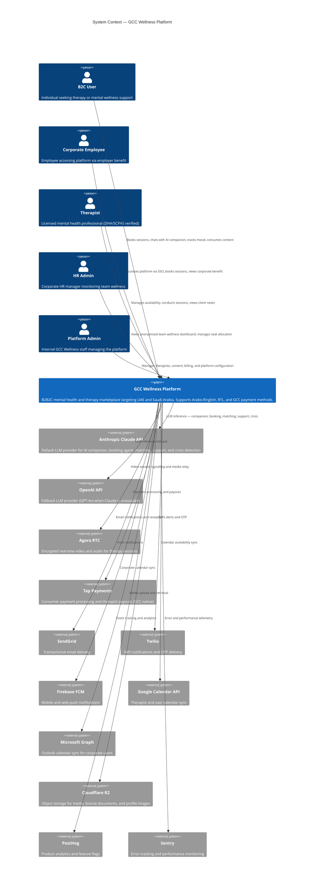
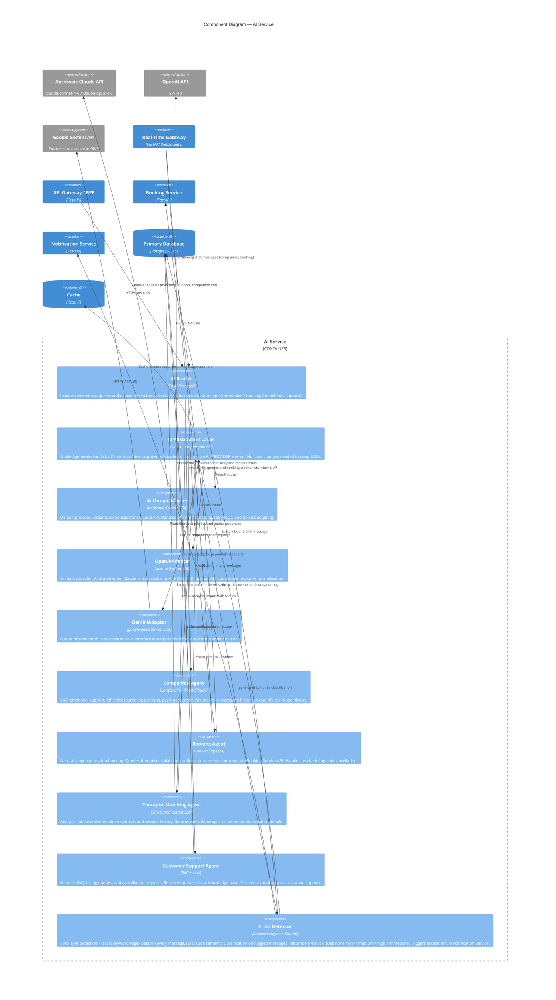

# GCC Wellness Platform — Architecture Reference

C4 Model diagrams covering all actors, containers, and key components of the GCC Wellness Platform. Use these as the authoritative architecture reference; the PRD section 4.1 diagram is a summary only.

---

## Level 1 — System Context

Shows the GCC Wellness Platform as a black box and all external actors and systems it interacts with.

---

## Level 2 — Container Diagram

Internal building blocks of the GCC Wellness Platform.

```mermaid
C4Container
    title Container Diagram — GCC Wellness Platform

    Person(b2c_user, "B2C User")
    Person(corp_employee, "Corporate Employee")
    Person(therapist, "Therapist")
    Person(hr_admin, "HR Admin")
    Person(platform_admin, "Platform Admin")

    System_Boundary(wellness_platform, "GCC Wellness Platform") {
        Container(web_client, "Web Client", "Next.js 14 PWA, Tailwind CSS, next-intl", "Server-rendered PWA. Arabic/English, RTL from day one. Offline-capable for content.")
        Container(api_gateway, "API Gateway / BFF", "FastAPI", "Single HTTPS entry point. Request routing, rate limiting, auth token validation, response shaping.")
        Container(auth_service, "Auth Service", "FastAPI, python-jose, JWT, OAuth2, SAML 2.0", "User authentication, session management, RBAC, corporate SSO (SAML for B2B).")
        Container(booking_service, "Booking Service", "FastAPI, SQLAlchemy, APScheduler", "Therapist availability management, session scheduling, calendar sync, reminder triggers.")
        Container(payment_service, "Payment Service", "FastAPI, Tap Payments SDK", "Consumer checkout, subscription billing, therapist payout calculation and transfer.")
        Container(ai_service, "AI Service", "FastAPI, AI Abstraction Layer", "Companion chat, booking agent, therapist matching, customer support. Routes to correct agent and LLM adapter.")
        Container(crisis_service, "Crisis Detection Service", "FastAPI, keyword engine, Claude API", "Real-time risk classification on all chat messages. Tiered escalation: low / medium / high / immediate.")
        Container(notification_service, "Notification Service", "FastAPI, SendGrid, Twilio, FCM", "Unified notification dispatch. Handles email, SMS, and push based on user channel preferences.")
        Container(content_service, "Content Service", "FastAPI, SQLAlchemy", "Article, audio, and video CMS. Supports Arabic and English content with tag-based recommendations.")
        Container(realtime_gateway, "Real-Time Gateway", "FastAPI WebSockets", "Persistent connections for live chat, AI streaming responses, and in-session status events.")
        ContainerDb(primary_db, "Primary Database", "PostgreSQL 16", "All persistent application data: users, sessions, bookings, payments, content, audit logs.")
        ContainerDb(cache, "Cache", "Redis 7", "Session tokens, rate limit counters, real-time presence state, AI response caching.")
        Container(object_storage, "Object Storage", "Cloudflare R2", "Profile images, therapist license documents, audio/video content files.")
    }

    System_Ext(claude_api, "Anthropic Claude API")
    System_Ext(openai_api, "OpenAI API")
    System_Ext(agora, "Agora RTC")
    System_Ext(tap_payments, "Tap Payments")
    System_Ext(sendgrid, "SendGrid")
    System_Ext(twilio, "Twilio")
    System_Ext(fcm, "Firebase FCM")
    System_Ext(google_cal, "Google Calendar API")
    System_Ext(ms_graph, "Microsoft Graph")

    Rel(b2c_user, web_client, "HTTPS / PWA")
    Rel(corp_employee, web_client, "HTTPS / SSO")
    Rel(therapist, web_client, "HTTPS")
    Rel(hr_admin, web_client, "HTTPS")
    Rel(platform_admin, web_client, "HTTPS")

    Rel(web_client, api_gateway, "REST / JSON over HTTPS")
    Rel(web_client, realtime_gateway, "WebSocket (WSS)")

    Rel(api_gateway, auth_service, "Validates JWT, delegates login/register")
    Rel(api_gateway, booking_service, "Session CRUD, availability queries")
    Rel(api_gateway, payment_service, "Checkout, subscription, payout")
    Rel(api_gateway, ai_service, "Companion, matching, support requests")
    Rel(api_gateway, content_service, "Article and media retrieval")
    Rel(api_gateway, notification_service, "Manual notification triggers")

    Rel(realtime_gateway, ai_service, "Streams AI responses to client")
    Rel(realtime_gateway, crisis_service, "Every chat message inspected in real time")

    Rel(booking_service, notification_service, "Triggers booking confirmations and reminders")
    Rel(payment_service, notification_service, "Triggers payment receipts and payout alerts")
    Rel(booking_service, google_cal, "Availability and invite sync")
    Rel(booking_service, ms_graph, "Corporate Outlook sync")

    Rel(ai_service, claude_api, "LLM inference (default)")
    Rel(ai_service, openai_api, "LLM inference (fallback)")
    Rel(crisis_service, claude_api, "Semantic risk classification")
    Rel(crisis_service, notification_service, "Escalation alerts to therapist / admin")

    Rel(payment_service, tap_payments, "Payment processing and payouts")
    Rel(notification_service, sendgrid, "Email")
    Rel(notification_service, twilio, "SMS")
    Rel(notification_service, fcm, "Push")

    Rel(web_client, agora, "Video/audio RTC (peer-to-peer relay)")

    Rel(auth_service, primary_db, "Read/write")
    Rel(booking_service, primary_db, "Read/write")
    Rel(payment_service, primary_db, "Read/write")
    Rel(ai_service, primary_db, "Read conversation history")
    Rel(content_service, primary_db, "Read/write")
    Rel(crisis_service, primary_db, "Write risk events and escalation log")

    Rel(auth_service, cache, "Session tokens, rate limits")
    Rel(api_gateway, cache, "Rate limiting")
    Rel(realtime_gateway, cache, "Presence state")
    Rel(ai_service, cache, "Response caching")

    Rel(content_service, object_storage, "Audio/video retrieval")
    Rel(auth_service, object_storage, "Profile image and license doc storage")
```

---

## Level 3 — Component Diagram: AI Service

Zooms into the AI Service container showing individual agents, the abstraction layer, and LLM adapters.

---

## Notes

### MVP vs v2 Infrastructure

| Concern | MVP (Months 1-7) | v2 (Month 8+) |
|---|---|---|
| Frontend hosting | Vercel | Vercel or AWS CloudFront |
| Backend hosting | Render (FastAPI containers) | AWS ECS / EKS, ap-middle-east-1 (Bahrain) |
| Database | Render PostgreSQL (managed) | AWS RDS Multi-AZ |
| Cache | Render Redis | AWS ElastiCache |
| Object storage | Cloudflare R2 | Cloudflare R2 (no change — cost-efficient) |
| AI provider | Claude API (primary), OpenAI (fallback) | Same — extend with Gemini adapter |
| Mobile | PWA only | React Native (iOS + Android) |
| Languages | Arabic (MSA + Gulf) + English | + Hindi + Urdu |
| Calendar sync | Google Calendar only | + Microsoft Graph (Outlook) for B2B |
| Therapist onboarding | Manual DHA/SCFHS verification | Semi-automated document verification |
| Crisis escalation | Keyword + Claude, alert to admin | Full MHFA-trained on-call integration |

### Key Architecture Constraints

- **Data residency:** All PostgreSQL data must remain in the GCC region. Use Render's Frankfurt region as interim; migrate to AWS Bahrain (ap-middle-east-1) in v2.
- **E2EE video:** Agora sessions are end-to-end encrypted. No recording by default. Any future recording feature requires explicit therapist and client consent with separate consent log.
- **AI provider swap:** The `AI_PROVIDER` environment variable controls which adapter is active. Valid values: `anthropic` (default), `openai`, `gemini`. No code deployment required to switch.
- **Crisis detection is non-negotiable:** The Crisis Detection Service must be live and passing all escalation tests before the platform opens to any real users.
- **RBAC roles:** `b2c_user`, `corporate_employee`, `therapist`, `hr_admin`, `platform_admin`. Enforced at API Gateway and validated in each service.
