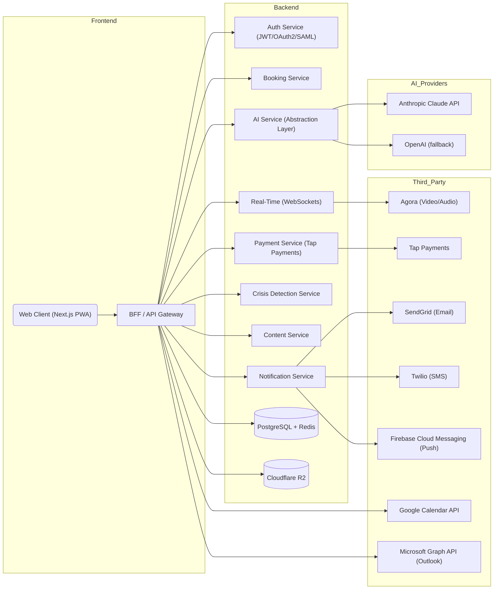
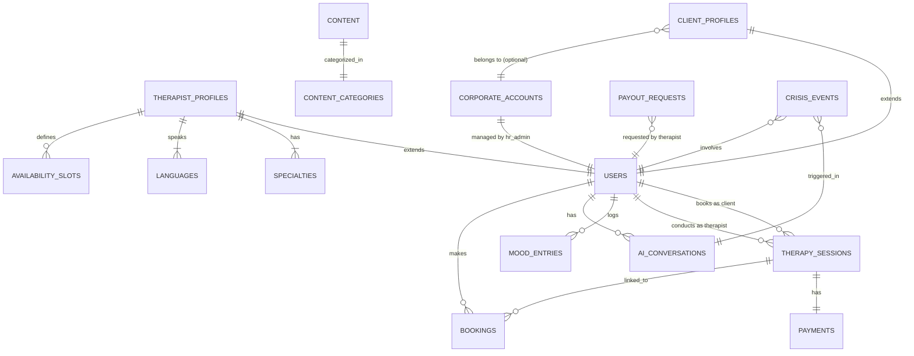
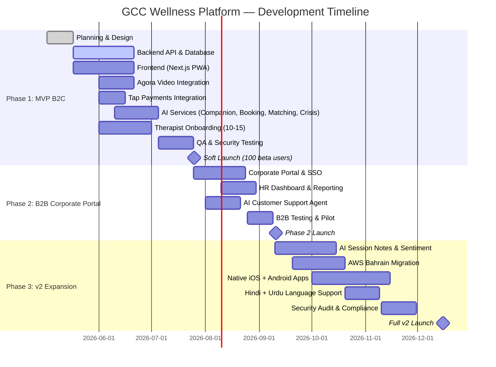

# Product Requirements Document
## GCC Wellness Platform — Mental Health & Therapy Marketplace

**Version:** 2.0
**Date:** 2026-05-02
**Status:** Draft

---

## 1. Executive Summary

### Problem Statement
Mental health services in the GCC are severely underserved — stigma, lack of Arabic-language providers, and no scalable digital access point leave millions without support. Existing platforms (e.g., Takalam) are limited in AI capability, corporate reach, and language coverage for the region's large expat population.

### Proposed Solution
A B2B2C mental health platform connecting GCC users with licensed therapists via a web-first marketplace, augmented by an AI companion, AI-powered booking and support agents, and a corporate employee wellness portal (EAP). A freemium AI companion serves as the top-of-funnel entry point, converting users to paid human therapy sessions.

### Success Criteria (KPIs)

| Metric | Target (6 months post-launch) |
|---|---|
| Registered users | 2,000+ |
| Completed therapy sessions | 500+ |
| AI companion monthly active users | 1,500+ |
| B2B corporate contracts signed | 3+ |
| Therapist retention rate | >= 85% |
| Session booking conversion rate (AI companion → paid session) | >= 15% |
| Crisis escalation response time | < 60 seconds |
| Content article monthly reads | 5,000+ |
| Platform uptime | >= 99.5% |

---

## 2. User Experience & Functionality

### 2.1 User Personas

**Persona 1: B2C User — "Layla"**
- 28-year-old Emirati professional in Dubai
- Experiencing anxiety and work stress
- Bilingual Arabic/English, uses iPhone daily
- Reluctant to seek therapy due to stigma, would try an AI companion first
- Willing to pay AED 200-500/session if she trusts the platform

**Persona 2: Corporate Employee — "Rahul"**
- 34-year-old Indian expat software engineer in Riyadh
- Enrolled via employer's wellness program
- Prefers English sessions, unfamiliar with local mental health resources
- Needs convenient evening slots due to work schedule

**Persona 3: Therapist — "Dr. Fatima"**
- Licensed clinical psychologist, DHA-registered in Dubai
- Currently sees private clients, wants to expand her reach digitally
- Needs a reliable scheduling tool, seamless video, and timely payouts
- Values platform reputation — will leave if clients complain about quality

**Persona 4: HR Manager — "Ahmed"**
- People & Culture Director at a 500-person bank in UAE
- Tasked with ESG/employee wellbeing reporting
- Needs utilization data to justify budget to CFO
- Cannot expose individual employee data under any circumstances

**Persona 5: Platform Administrator — "Sara"**
- Internal staff member managing platform operations
- Reviews and approves therapist applications, moderates content
- Monitors compliance, system health, and handles escalated support tickets
- Needs audit logs and reporting dashboards to ensure regulatory compliance

---

### 2.2 User Stories & Acceptance Criteria

#### B2C User

**Story 1: Anonymous Entry**
> As a visitor, I want to explore the platform without creating an account so that I can evaluate it before committing.

**Acceptance Criteria:**
- Visitor can complete a 5-question mood check-in without registration
- AI companion chat is accessible for up to 3 messages before account prompt
- Therapist profiles are browsable without login
- Account creation is required only at the point of booking

---

**Story 2: AI Companion Chat**
> As a registered user, I want to chat with an AI companion 24/7 so that I have emotional support between therapy sessions or before committing to one.

**Acceptance Criteria:**
- AI responds within 3 seconds for 95th percentile of requests
- Supports Arabic (MSA + Gulf dialect) and English within same conversation
- RTL rendering is correct for Arabic text
- After 3 sessions, companion surfaces a contextual prompt to book a therapist
- All conversations are stored encrypted, accessible only to the user
- Crisis detection runs on every message (see Section 2.6)
- "Talk to a human" escape hatch visible at all times in chat UI

---

**Story 3: Therapist Discovery & Matching**
> As a user, I want to be matched with a suitable therapist so that I don't waste time browsing profiles that aren't relevant to my needs.

**Acceptance Criteria:**
- After 5-question intake, AI recommends exactly 3 therapists ranked by match score
- Each profile displays: specializations, languages spoken, session price, availability slots, rating, and credential verification badge
- User can override AI recommendation and browse all therapists
- Filters available: language, specialization, price range, gender, availability
- Match algorithm considers: intake answers, language preference, availability, therapist rating

---

**Story 4: Session Booking**
> As a user, I want to book a therapy session via natural language or calendar UI so that scheduling is frictionless.

**Acceptance Criteria:**
- AI booking agent accepts natural language input (e.g., "Book me a session with Dr. Sara on Tuesday evening")
- AI booking agent confirms booking details before finalizing
- Calendar UI shows therapist availability in user's local timezone (auto-detected)
- Booking confirmation sent via email and push notification within 60 seconds
- Reminders sent 24 hours and 1 hour before session via email, SMS, and push notification
- User can sync session to Google Calendar or Microsoft Outlook via one-click OAuth flow
- User can add session to Apple Calendar via ICS link
- Recurring weekly booking supported with single cancellation option

---

**Story 5: Video Session**
> As a user, I want to attend a therapy session via video so that I can have a private, high-quality clinical experience.

**Acceptance Criteria:**
- Video powered by Agora SDK, supports 720p minimum
- Therapist-controlled waiting room — client sees "Your therapist will join shortly"
- Text chat panel available alongside video for sharing links or exercises
- 5-minute warning notification before session end
- Therapist can extend session by 15 minutes (one extension per session)
- On connection drop: automatic rejoin attempt for 2 minutes, session marked "interrupted" after 5 minutes
- Interrupted sessions before 10-minute mark: full session credit refunded
- Interrupted sessions after 10-minute mark: priority rebooking offered, no refund
- No session recording by default; recording requires explicit written consent from both parties before session starts

---

**Story 6: Mood Tracking**
> As a user, I want to log my mood daily so that I can track my emotional progress over time.

**Acceptance Criteria:**
- Daily mood check-in takes < 60 seconds (emoji scale + optional text note)
- Mood history displayed as a timeline chart (last 30/90 days)
- Mood data visible to user only; therapist can request access and user must explicitly grant it
- Data stored encrypted at rest
- Push notification reminder at user-configured time (opt-in)

---

**Story 7: Content Library**
> As a user, I want to access mental health articles, guided meditations, and wellness resources so that I can build coping skills between sessions.

**Acceptance Criteria:**
- Content library accessible to all registered users (free tier)
- Content categories: anxiety, depression, relationships, work stress, sleep, mindfulness
- Articles display estimated reading time; audio/guided meditations display duration
- Content personalized based on intake answers and mood tracking history
- Search and filter by category, format (article/audio/video), and language
- Content available in Arabic and English
- Push notification when new relevant content is published (opt-in)
- Culturally relevant content for GCC context (e.g., Ramadan wellness, family dynamics)

---

#### Therapist

**Story 8: Availability Management**
> As a therapist, I want to manage my availability calendar so that clients can only book slots I've designated as open.

**Acceptance Criteria:**
- Therapist sets recurring weekly availability (e.g., Mon-Wed 6PM-9PM)
- Can block individual slots or days without affecting recurrence
- 15-minute buffer automatically enforced between consecutive sessions
- Calendar displays in therapist's local timezone
- Optional two-way sync with Google Calendar or Microsoft Outlook via OAuth
- System prevents double-booking

---

**Story 9: Client Dashboard**
> As a therapist, I want to view my clients' profiles and intake information so that I can prepare for sessions.

**Acceptance Criteria:**
- Client profile shows: intake questionnaire answers, session history, notes from previous sessions
- Therapist can add session notes (private, only therapist can view unless client requests)
- Mood tracking data visible only if client has granted explicit permission
- Client contact outside of platform sessions via secure in-platform messaging only

---

**Story 10: Earnings & Payouts**
> As a therapist, I want to view my earnings and request payouts so that I'm compensated reliably.

**Acceptance Criteria:**
- Earnings dashboard shows: completed sessions, pending sessions, total earned, platform fee (30%), net payout
- Payout request available when balance >= AED 100
- Payout processed via bank transfer within 5 business days
- Monthly earnings statement downloadable as PDF

---

#### Corporate HR

**Story 11: Corporate Portal**
> As an HR manager, I want to manage my company's wellness program so that employees can access therapy while I track utilization.

**Acceptance Criteria:**
- HR admin can add/remove employees via CSV upload or manual entry
- Employee identity is never visible in utilization reports
- Reports show: total sessions used, sessions remaining, utilization % by department (min. 5 employees per department to prevent de-anonymization), monthly trend
- Quarterly utilization report auto-emailed to HR admin
- Employee onboarding via company code + email domain verification
- SSO via OAuth2 (Google Workspace) and SAML 2.0 (Azure AD) supported
- Session credits managed as pool (company buys X sessions, any employee draws from pool)

---

#### Platform Administrator

**Story 12: Therapist Verification**
> As a platform admin, I want to review and approve therapist applications so that only verified, licensed professionals are on the platform.

**Acceptance Criteria:**
- Admin dashboard lists pending applications with uploaded documents
- Admin can approve, request more info, or reject with documented reason
- Approval triggers therapist account activation and welcome email
- Rejection triggers email with explanation and appeal instructions
- License verification status logged with admin ID and timestamp (audit trail)

---

**Story 13: Content Management**
> As a platform admin, I want to publish and manage wellness content so that users have access to high-quality, culturally relevant resources.

**Acceptance Criteria:**
- Admin can create, edit, publish, unpublish, and delete articles/audio/video content
- Content goes through a draft → review → published workflow
- Admin can tag content by category, language, and persona
- Content analytics visible: views, average read time, user ratings

---

**Story 14: Compliance & Audit**
> As a platform admin, I want to access audit logs and compliance reports so that the platform meets regulatory requirements.

**Acceptance Criteria:**
- Audit log captures: all PHI access events, admin actions, therapist verification events, crisis events
- Logs are read-only, tamper-evident, retained for 7 years
- Admin can filter logs by user ID, event type, and date range
- Monthly automated compliance report covering: data access events, crisis escalations, account deletions

---

### 2.3 Non-Goals (MVP)

The following are explicitly out of scope for MVP:

- Native iOS / Android apps (PWA only)
- White-labeling / custom branding for corporate clients
- AI-generated session notes / clinical summaries
- AI mood insights and pattern analysis
- Session transcription (v2, requires additional consent infrastructure)
- Sentiment analysis dashboard for therapists
- Group therapy sessions
- Psychiatry / medication management
- Hindi, Urdu, French language support
- Peer support communities or forums
- Therapist supervision network
- Calendar two-way sync (one-click export only in MVP; full OAuth sync in v2)
- AWS Middle East infrastructure (Vercel + Render for MVP)
- In-app payment for corporate clients (invoice only)
- EHR / HL7/FHIR integration

---

### 2.4 Onboarding Flows

#### B2C Onboarding
```
1. Landing page → "Start for free" CTA
2. Anonymous mood check-in (no account needed)
3. 5-question intake assessment (areas of concern, language, therapist gender preference, availability)
4. AI recommends 3 therapists + offers AI companion chat
5. User creates account (email or Google SSO)
6. Books session OR continues with AI companion
7. After 3 AI conversations → contextual prompt "Ready to speak to a licensed therapist?"
```

#### Corporate Employee Onboarding
```
1. Employee receives invite link or company code from HR
2. Email domain verified OR SSO login
3. 5-question intake assessment (same as B2C)
4. AI recommends 3 therapists from platform pool
5. Session deducted from company credit pool
6. Employee identity never shared with HR
```

---

### 2.5 Cancellation & Refund Policy

| Cancellation timing | Outcome |
|---|---|
| > 48 hours before session | Full refund |
| 24-48 hours before session | 50% session credit |
| < 24 hours before session | No refund |
| Session interrupted before 10 min | Full credit refunded |
| Session interrupted after 10 min | Priority rebooking, no refund |
| Therapist no-show | Full refund + AED 50 platform credit |

---

### 2.6 Crisis & Safety Protocol

**Trigger Detection:** AI sentiment analysis (Claude API) combined with keyword matching on every message. Operates in real-time, never async.

**Tiered Response:**

| Risk Level | Signals | Platform Response |
|---|---|---|
| Low | Sadness, hopelessness without explicit self-harm mention | Gentle check-in prompt, suggest booking a session |
| Medium | Explicit distress, passive self-harm ideation | Surface crisis resources, prominent "Talk to someone now" button, suggest emergency session |
| High | Active suicidal ideation, explicit self-harm intent | Pause conversation, display local emergency numbers full-screen, trigger on-call therapist alert |

**Country-Specific Crisis Numbers:**
- UAE: 800-4673 (800-HOPE), Dubai Police: 999
- Saudi Arabia: 920033360, Civil Defense: 998
- Kuwait: 94005050
- Bahrain: 80008001

**Therapist Notification:** If an existing client (with a therapist assigned) triggers medium or high risk between sessions, the therapist receives an in-platform alert within 5 minutes.

**Logging:** Every crisis event logged with: timestamp, risk level, trigger signals, platform response taken, user ID. Retained for 7 years. Access restricted to platform safety officer.

**Terms of Service:** Clearly states that confidentiality does not apply when there is imminent risk of harm to self or others, in compliance with GCC jurisdiction requirements.

---

## 3. AI System Requirements

### 3.1 AI Features

| Feature | Description | Phase |
|---|---|---|
| AI Companion Chat | 24/7 emotional support, journaling prompts, psychoeducation | MVP |
| AI Booking Agent | Natural language session booking, availability queries | MVP |
| AI Customer Support Agent | FAQ, billing, cancellation, account queries | MVP |
| AI Therapist Matching | Intake analysis → ranked therapist recommendations | MVP |
| Crisis Detection | Real-time sentiment + keyword analysis, tiered escalation | MVP (non-negotiable) |
| Sentiment Analysis | In-session and journal text emotion classification, therapist dashboard | v2 |
| AI Mood Insights | Pattern analysis, trend summaries surfaced to user | v2 |
| AI Session Notes | Post-session summary draft for therapist review (consent required) | v2 |
| Session Transcription | Opt-in audio-to-text, encrypted, therapist-only access | v2 |
| Multilingual AI | Hindi, Urdu, French language support across all AI features | v2 |

---

### 3.2 AI Architecture — Model Abstraction Layer

All AI features must be routed through an **AI Provider Abstraction Layer** to enable model swapping without code changes.

```
┌─────────────────────────────────────────┐
│           Application Layer             │
│  (Companion, Booking, Support, Match)   │
└────────────────┬────────────────────────┘
                 │
┌────────────────▼────────────────────────┐
│        AI Abstraction Layer             │
│  - Unified interface: generate(), chat()│
│  - Provider config via environment vars │
│  - Prompt template management          │
│  - Response validation & safety filter  │
│  - Automatic fallback on rate limit     │
└────────────────┬────────────────────────┘
                 │
    ┌────────────▼─────────────┐
    │   Provider Adapters      │
    │  - AnthropicAdapter      │  ← Default (Claude)
    │  - OpenAIAdapter         │
    │  - GeminiAdapter         │
    └──────────────────────────┘
```

**Configuration:**
```env
AI_PROVIDER=anthropic          # Switch to: openai, google
AI_MODEL=claude-sonnet-4-6     # Model ID per provider
AI_FALLBACK_PROVIDER=openai    # Automatic fallback on rate limit
```

**Switching model requires:** Environment variable change + deployment. Zero code changes.

---

### 3.3 AI Model Selection — Trade-offs

For each AI feature, the decision between open-source (self-hosted) and hosted API involves cost, data control, and quality trade-offs:

| Component | Task | Open-Source Option | Hosted API Option | Recommendation |
|---|---|---|---|---|
| Companion Chat | Conversational support | LLaMA 3, Mistral (self-hosted GPU) | Claude API, GPT-4o | Hosted API (Claude) — best safety guardrails for mental health context |
| Booking Agent | NLU intent + slot filling | Rasa (self-hosted) | Claude/GPT-4o with function calling | Hosted API — simplest integration, high accuracy |
| Therapist Matching | Recommendation ranking | Scikit-learn (custom) | OpenAI Embeddings + Claude | Hybrid — embeddings for semantic similarity, Claude for nuanced explanation |
| Sentiment Analysis | Emotion classification | BERT/RoBERTa (HuggingFace) | OpenAI Moderation API | Open-source (v2) — run locally for PHI compliance, no data leaves platform |
| Session Summarization | LLM summarization | LLaMA 3, Flan-T5 | GPT-4o, Claude | Hosted API with explicit no-training data agreement |
| Crisis Detection | Risk classification | BERT fine-tuned (keyword + NLP) | Claude API | Both layers — keyword as fast layer, Claude for semantic depth |
| Multilingual NLP | Translation + multilingual NLU | mBERT, M2M100 | GPT-4o (multi-language) | Hosted API for MVP; evaluate open-source at scale |

**Privacy-Preserving ML principles:**
- AI inputs/outputs containing user content are treated as PHI
- External API providers must confirm data is not retained or used for model training
- Session transcripts and summaries (v2): encrypted before sending to AI provider, decrypted only in-platform
- No personally identifiable information in prompts sent to external APIs — user IDs are anonymized
- Evaluate on-device inference (ONNX, llama.cpp) for crisis detection in v3 to eliminate external data transmission

---

### 3.4 AI Companion — Behavioral Requirements

- **Persona:** Warm, non-judgmental, culturally aware of GCC norms around mental health and family
- **Scope:** Supportive listening, psychoeducation, journaling prompts, breathing exercises, mood check-ins. NOT diagnosis, NOT treatment recommendations, NOT medication advice
- **Boundaries enforced via system prompt:** Companion always defers clinical questions to licensed therapists
- **Language:** Responds in the language the user writes in (Arabic or English), maintains language consistency within a session
- **Safety:** Crisis detection runs on every message before response is generated. If high-risk detected, response is replaced with crisis protocol output regardless of AI response content.

---

### 3.5 AI Booking Agent — Functional Requirements

- Understands natural language booking requests in Arabic and English
- Queries therapist availability in real-time via internal API
- Confirms all booking details with user before committing (therapist name, date, time, price, timezone)
- Handles ambiguous requests with clarifying questions (e.g., "Tuesday" → "This Tuesday, May 5th?")
- Falls back to calendar UI if booking cannot be completed via conversation after 3 attempts
- Never books without explicit user confirmation ("Yes, confirm my booking")

---

### 3.6 AI Evaluation Strategy

| Feature | Evaluation Method | Pass Threshold |
|---|---|---|
| Companion chat quality | Monthly review of 50 random conversations by clinical advisor | >= 90% rated "appropriate and helpful" |
| Crisis detection accuracy | Quarterly red-team testing with 100 synthetic crisis scenarios | >= 98% high-risk correctly escalated, 0% missed high-risk |
| Booking agent success rate | Automated tracking of completed vs. failed booking conversations | >= 85% successful completion |
| Therapist matching relevance | Post-session user survey: "Was your therapist a good match?" | >= 80% positive |
| Customer support resolution | Ticket deflection rate (resolved without human handoff) | >= 70% |
| Sentiment analysis accuracy (v2) | Benchmark against labeled mental health dataset | >= 85% F1 score |

---

## 4. Technical Specifications

### 4.1 System Architecture



---

### 4.2 Entity Relationship Diagram



---

### 4.3 Database Schema (Core Entities)

```sql
-- Users (all roles)
users: id, email, hashed_password, role (client|therapist|hr_admin|platform_admin),
       full_name, preferred_language, timezone, created_at, deleted_at

-- Client profiles
client_profiles: user_id, intake_data (jsonb encrypted), mood_tracking_enabled,
                 corporate_id (nullable), onboarding_completed_at

-- Therapist profiles
therapist_profiles: user_id, license_number, license_authority (DHA|SCFHS|MOH),
                    license_verified_at, license_document_url, specializations (array),
                    languages (array), session_price_aed, bio, avatar_url,
                    malpractice_insurance_url, status (pending|active|suspended|removed),
                    probation_sessions_remaining, verified_by_admin_id

-- Sessions
therapy_sessions: id, client_id, therapist_id, scheduled_at, duration_minutes,
                  status (scheduled|in_progress|completed|cancelled|interrupted),
                  agora_channel_id, price_aed, platform_fee_aed, therapist_payout_aed,
                  cancelled_at, cancellation_reason, refund_issued, session_rating

-- Bookings
bookings: id, session_id, booked_by (user_id), booking_source (ai_agent|calendar_ui),
          corporate_credit_used (boolean), created_at

-- AI conversations
ai_conversations: id, user_id, feature (companion|booking|support|matching),
                  messages (jsonb encrypted), crisis_flags (jsonb), created_at

-- Mood tracking
mood_entries: id, user_id, score (1-10), note (encrypted), logged_at

-- Corporate accounts
corporate_accounts: id, company_name, hr_admin_id, session_credits_total,
                    session_credits_used, contract_start, contract_end,
                    sso_provider, sso_config (jsonb encrypted)

-- Therapist availability
availability_slots: id, therapist_id, day_of_week, start_time, end_time,
                    is_recurring, specific_date (nullable), is_blocked

-- Payouts
payout_requests: id, therapist_id, amount_aed, status (pending|processing|paid|failed),
                 bank_details_ref, requested_at, processed_at

-- Crisis events
crisis_events: id, user_id, conversation_id, risk_level (low|medium|high),
               trigger_signals (jsonb), platform_response, therapist_notified,
               therapist_notified_at, logged_at

-- Content
content: id, title, body, format (article|audio|video), language,
         category_id, author, published_at, status (draft|review|published),
         view_count, average_rating

-- Audit log (append-only)
audit_log: id, actor_id, actor_role, event_type, resource_type, resource_id,
           ip_address, user_agent, metadata (jsonb), logged_at
```

---

### 4.4 Integration Points

| Integration | Provider | Purpose |
|---|---|---|
| AI (primary) | Anthropic Claude API | Companion, booking, support, matching, crisis |
| AI (fallback) | OpenAI GPT-4o | Automatic failover when Claude rate-limited |
| Video | Agora RTC | Therapy video/audio sessions |
| Payments | Tap Payments | Consumer session payments (mada, Apple Pay, cards, KNET) |
| Email | SendGrid | Booking confirmations, reminders, payout statements |
| SMS | Twilio | Session reminders, OTP, crisis notifications |
| Push Notifications | Firebase Cloud Messaging (FCM) | In-app alerts, reminders, content updates |
| Calendar Sync | Google Calendar API + Microsoft Graph (Outlook) | Two-way calendar sync for therapists (v2) / one-click export for clients (MVP via ICS) |
| SSO | OAuth2 (Google Workspace) + SAML 2.0 (Azure AD) | Corporate employee authentication |
| Storage | Cloudflare R2 | Profile images, license documents, content media |
| Analytics | PostHog | Product analytics (anonymized user IDs only) |
| Error Monitoring | Sentry | Application error tracking (no PHI in error payloads) |

---

### 4.5 Authentication & Authorization

- **B2C users:** Email/password + Google OAuth2. JWT access tokens (15min expiry) + refresh tokens (30 days)
- **Corporate employees:** Company SSO (OAuth2/SAML) or email domain verification + company code
- **Therapists:** Email/password only (no SSO), TOTP 2FA required
- **Platform admins:** Email/password + TOTP 2FA mandatory

**Role-based access control (RBAC):**

| Role | Access |
|---|---|
| `client` | Own profile, own sessions, own AI conversations, own mood data |
| `therapist` | Own profile, own sessions, assigned client profiles only |
| `hr_admin` | Corporate account, anonymized utilization reports, employee roster (no session data) |
| `platform_admin` | Full read access, therapist verification, crisis event logs, audit logs — no AI conversation content |

---

### 4.6 Internationalisation (i18n)

- Framework: `next-intl`
- Default locale: `en`
- Supported locales at launch: `en`, `ar`
- RTL layout: controlled via `dir` attribute on `<html>`, driven by locale
- All UI strings in `/messages/{locale}.json` — no hardcoded strings in components
- Arabic date/time formatting via `Intl.DateTimeFormat` with `ar-AE` locale
- Currency: AED formatted as `Intl.NumberFormat('ar-AE', { style: 'currency', currency: 'AED' })`
- Adding a new language in v2 requires: translation file + locale config. Zero code changes.

---

### 4.7 Security & Privacy

**Data classification:**

| Data Type | Classification | Access | Retention |
|---|---|---|---|
| Session notes | Sensitive health | Therapist only | 7 years |
| AI conversation logs | Sensitive health | User only | 3 years or on deletion request |
| Mood entries | Sensitive health | User only (opt-in therapist) | User-controlled |
| Crisis event logs | Sensitive health | Platform safety officer only | 7 years |
| Session metadata | Confidential | Client + therapist | 7 years |
| Corporate utilization reports | Internal | HR admin (anonymized) | 3 years |
| License documents | Confidential | Platform admin | Duration of therapist account + 2 years |
| Audit logs | Internal | Platform admin (read-only) | 7 years |

**Encryption:**
- All sensitive health data encrypted at rest (AES-256)
- AI conversation messages encrypted at application layer before DB storage
- TLS 1.3 for all data in transit
- Agora video sessions: end-to-end encrypted via WebRTC insertable streams
- No PHI transmitted to external APIs — user IDs anonymized in all AI prompts

**Data deletion:**
- User "delete my account" flow: hard delete of all health data within 30 days, anonymized billing records retained for legal compliance
- UAE PDPL Article 29 compliant data deletion workflow

**Vulnerability management:**
- Dependency scanning via Dependabot (weekly)
- OWASP Top 10 addressed before launch: parameterized queries (SQLi), React default escaping (XSS), SameSite cookies (CSRF), rate limiting (brute force)
- No PII or PHI in server logs — structured logging with anonymized IDs only
- Regular penetration testing: before launch, then annually

---

### 4.8 Performance Requirements

| Metric | Target |
|---|---|
| Page load (LCP) | < 2.5s on 4G connection |
| AI companion response time (P95) | < 3s |
| Booking confirmation end-to-end | < 5s |
| Video session join time | < 10s from "Join" click |
| API response time (P99, non-AI) | < 500ms |
| Push notification delivery | < 5s from trigger event |
| Platform uptime | >= 99.5% monthly |

---

### 4.9 Testing Strategy

**Unit Tests**
- Backend: PyTest for all FastAPI service logic, minimum 80% coverage
- Frontend: Jest + React Testing Library for component logic
- All tests run in CI on every pull request

**Integration Tests**
- End-to-end API workflow tests (booking flow, payment flow, crisis escalation flow) via pytest + httpx
- Stripe/Tap webhook simulation in test environment
- Agora session lifecycle mocked in integration suite

**End-to-End (E2E) Tests**
- Cypress test suite covering critical user paths:
  - Anonymous entry → intake → therapist browse
  - Account creation → booking → session join
  - AI companion → crisis trigger → escalation response
  - Corporate employee onboarding → session booking
- Run nightly against staging environment

**Performance Tests**
- k6 load tests: simulate 500 concurrent users booking sessions
- Agora stress test: 50 concurrent video sessions from GCC network locations
- Target: API P99 < 500ms at 500 concurrent users

**Security Tests**
- OWASP ZAP automated scan before every release
- Static analysis: Bandit (Python), ESLint security rules (JS)
- Manual penetration test before public launch

**AI Validation**
- Clinical advisor reviews 50 randomly sampled AI companion conversations monthly
- Automated red-team suite: 100 synthetic crisis scenarios run against crisis detection service quarterly
- Booking agent success rate tracked automatically per release
- All AI prompt changes require clinical advisor sign-off before deployment

**Compliance Checks**
- Automated test: verify data deletion within 30 days of request
- Verify no PHI appears in application logs (log scanning script in CI)
- Consent screen presence verified in E2E test suite

---

### 4.10 Deployment & Scalability

**MVP Infrastructure (Vercel + Render)**
- Next.js frontend: Vercel (Edge Network, global CDN)
- FastAPI backend: Render (auto-scaling web service)
- PostgreSQL: Render managed Postgres
- Redis: Render managed Redis
- Storage: Cloudflare R2
- All services communicate via environment variables — no hardcoded endpoints

**v2 Infrastructure (AWS Middle East — Bahrain region)**
- Frontend: CloudFront CDN + S3 static hosting or Vercel (retain)
- Backend: ECS Fargate (containerized FastAPI, auto-scaling)
- Database: RDS PostgreSQL (Multi-AZ, encrypted at rest)
- Cache: ElastiCache Redis
- Storage: S3 (server-side encryption, versioning enabled)
- Secrets: AWS Secrets Manager
- Container orchestration: Docker + ECS (Kubernetes via EKS if scale demands)
- Infrastructure as code: Terraform (enables reproducible environments and cloud migration)

**CI/CD Pipeline (GitHub Actions)**
```
Push → Lint + Unit Tests → Integration Tests → Build Docker Image
→ Deploy to Staging → E2E Tests → Manual Approval → Deploy to Production
```

**Monitoring & Alerting**
- Application errors: Sentry (no PHI in payloads)
- Infrastructure metrics: AWS CloudWatch (v2) / Render metrics (MVP)
- Product analytics: PostHog (anonymized)
- Uptime monitoring: Better Uptime or Pingdom
- Alerts: PagerDuty for P0 incidents (service down, crisis service failure)

**Scaling triggers:**
- Horizontal scale-out at >70% CPU sustained for 2 minutes
- Pre-warm compute 30 minutes before scheduled session peak hours
- Redis session cache to reduce DB load at scale

---

## 5. Risks & Roadmap

### 5.1 Development Timeline



---

### 5.2 Phased Feature Roadmap

#### Phase 1 — MVP B2C (Month 1-4)
- Therapist profiles, verification, onboarding (10-15 therapists)
- User registration, intake, AI therapist matching
- AI companion chat with crisis detection
- Session booking (AI agent + calendar UI)
- Video sessions (Agora)
- Payments (Tap Payments)
- Mood tracking
- Content library (Arabic + English)
- Arabic + English, full RTL support
- Therapist dashboard (availability, clients, earnings)
- Admin dashboard (therapist verification, content management, audit logs)
- Push notifications (FCM)
- Soft launch: 100 beta users, collect NPS and session completion rates

#### Phase 2 — B2B Corporate Portal (Month 5-7)
- Corporate account management
- SSO (OAuth2 + SAML)
- Pool-based session credits
- Anonymized HR utilization dashboard
- Annual contract + invoicing flow
- AI customer support agent
- Target: 3 corporate pilot clients

#### Phase 3 — v2 Feature Expansion (Month 8-12)
- AI session notes (therapist-reviewed, consent-required)
- AI mood insights and pattern summaries
- Session transcription (opt-in, encrypted)
- Sentiment analysis dashboard for therapists
- Recurring auto-booking
- Google Calendar / Outlook two-way sync
- AWS Middle East (Bahrain) migration
- Native iOS + Android apps
- Hindi + Urdu language support
- White-label option for enterprise
- Therapist open marketplace (self-registration)

---

### 5.3 Technical Risks

| Risk | Likelihood | Impact | Mitigation |
|---|---|---|---|
| Claude API rate limits during peak sessions | Medium | High | Implement AI fallback provider (OpenAI) via abstraction layer; queue non-real-time requests |
| Agora video quality issues in GCC | Low | High | Load test from UAE/KSA before launch; have Daily.co as fallback integration |
| Tap Payments integration delays | Medium | High | Start integration in Week 1; test sandbox extensively; have Stripe as backup for UAE |
| Therapist supply shortage at launch | High | High | Begin therapist recruitment 8 weeks before launch; target 15 before soft launch |
| Crisis detection false negatives | Low | Critical | Red-team testing with clinical advisor; err on side of over-escalation; quarterly audits |
| GCC data residency regulatory change | Low | High | Architect for easy cloud migration; document data flows for legal review |
| Vercel/Render infrastructure limits at scale | Medium | Medium | Architect stateless services; migrate to AWS at 500+ DAU |
| PDPL compliance gaps | Medium | High | Engage GCC legal counsel before soft launch; DPA/privacy policy reviewed by counsel |
| AI provider data retention policy change | Medium | High | Contractual data processing agreements; monitor provider policy changes; fallback to open-source models |
| Third-party vendor outage (Twilio, SendGrid) | Low | Medium | Fallback SMS provider (Vonage); fallback email (AWS SES) |

---

### 5.4 Cost Estimates

**Development Costs:**

| Phase | Scope | Estimated Cost |
|---|---|---|
| Phase 1 — MVP B2C | Core platform, AI companion, booking, video, payments | $100,000 – $150,000 |
| Phase 2 — B2B Portal | Corporate portal, SSO, HR dashboard, customer support AI | +$50,000 – $75,000 |
| Phase 3 — v2 Expansion | AI session notes, mobile apps, multilingual, AWS migration | +$75,000 – $100,000 |
| **Total** | | **$225,000 – $325,000** |

*Based on a 3-person in-house core team + freelance DevOps/QA at GCC/remote rates.*

**Ongoing Monthly Infrastructure Costs (post-MVP):**

| Service | Estimated Monthly Cost |
|---|---|
| Vercel + Render (MVP) | $100 – $300 |
| AWS Middle East / Bahrain (v2) | $800 – $2,500 |
| Agora video (per minute charges) | $200 – $800 |
| Claude API (AI features) | $300 – $1,000 |
| Twilio SMS | $50 – $200 |
| SendGrid email | $20 – $100 |
| Firebase FCM | Free – $50 |
| **Total (MVP)** | **~$700 – $2,400/month** |
| **Total (v2 at scale)** | **~$1,500 – $5,000/month** |

---

### 5.5 Open Questions Before Launch

1. **Legal entity:** Which jurisdiction to incorporate? (UAE DIFC / Mainland / Saudi?)
2. **Clinical advisor:** Part-time licensed therapist retained for AI prompt review and crisis protocol validation — identify and contract before development starts
3. **DHA/SCFHS verification:** Confirm process for programmatic or manual license status checks against regulatory databases
4. **Tap Payments MCC:** Confirm merchant category code for mental health / telehealth services
5. **Malpractice coverage:** Does the platform require umbrella liability coverage beyond therapist-held insurance?
6. **Data processing agreements:** Obtain written confirmation from Anthropic / OpenAI that session-related prompts are not used for model training
7. **Content strategy:** Who produces Arabic mental health content for launch? In-house clinical writer vs. licensed content partnerships?

---

## Appendix A: Technology Stack Summary

| Layer | Technology |
|---|---|
| Frontend | Next.js 14+ (App Router), Tailwind CSS, next-intl |
| Backend | Python 3.12+, FastAPI, SQLAlchemy, Alembic |
| Database | PostgreSQL 16, Redis 7 |
| AI (primary) | Claude API (Anthropic) via abstraction layer |
| AI (fallback) | OpenAI GPT-4o |
| Video | Agora RTC SDK |
| Payments | Tap Payments |
| Push Notifications | Firebase Cloud Messaging (FCM) |
| Calendar Export | ICS standard (MVP); Google Calendar API + Microsoft Graph (v2) |
| Auth | JWT, OAuth2, SAML 2.0, python-jose |
| Hosting (MVP) | Vercel (frontend), Render (backend + DB), Cloudflare R2 (storage) |
| Hosting (v2) | AWS ap-middle-east-1 Bahrain (ECS Fargate, RDS, S3, CloudFront) |
| Infrastructure as Code | Terraform |
| Containers | Docker |
| CI/CD | GitHub Actions |
| Error Monitoring | Sentry |
| Product Analytics | PostHog |
| Uptime Monitoring | Better Uptime |

---

## Appendix B: Feature Parity with Takalam

| Feature | Takalam | This Platform |
|---|---|---|
| Licensed counselor directory | Yes | Yes + AI matching, dynamic filters, real-time availability |
| AI chat companion | Yes (Aila, Arabic + English) | Yes + multilingual (v2), sentiment-aware, crisis detection |
| Session scheduling | Yes | Yes + AI booking agent, natural language, calendar sync |
| Video sessions | Yes (secure) | Yes + Agora E2EE, waiting room, text chat alongside video |
| Payment processing | Yes (Stripe) | Yes (Tap Payments — full GCC coverage including mada, KNET) |
| Mood tracking | Yes | Yes + push reminders, therapist access opt-in |
| Educational content | Yes (articles) | Yes + audio/video, personalized recommendations, push notifications |
| Multilingual support | English + Arabic | Arabic (MSA + Gulf dialect) + English at launch; Hindi/Urdu in v2 |
| Mobile apps | iOS + Android | PWA at launch; native iOS + Android in v2 |
| Corporate / B2B portal | No | Yes — pool credits, SSO, anonymized HR reporting |
| Crisis protocol | Basic | Tiered AI detection, country-specific numbers, therapist alerts, full logging |
| Admin dashboard | Unknown | Yes — therapist verification, content management, audit logs |
