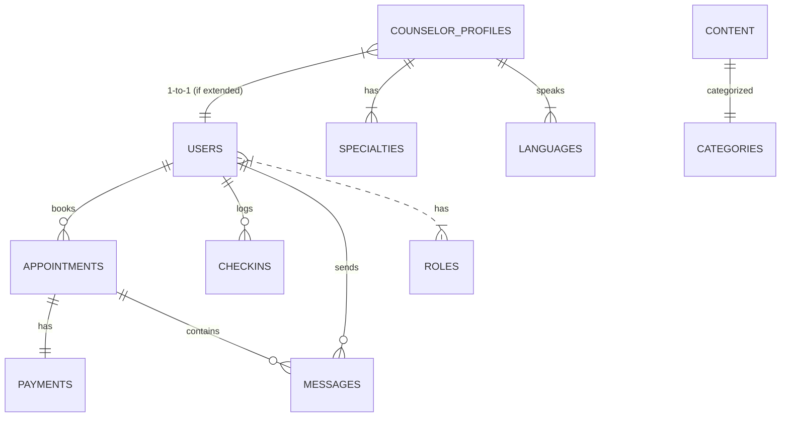
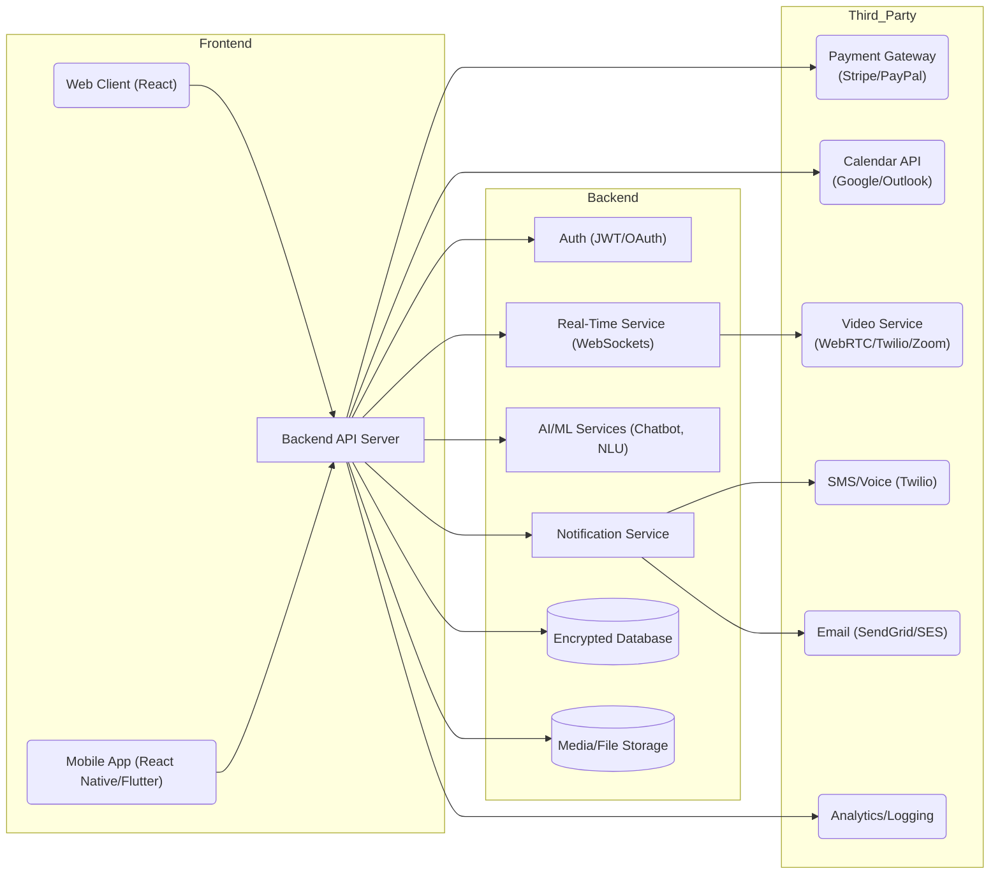
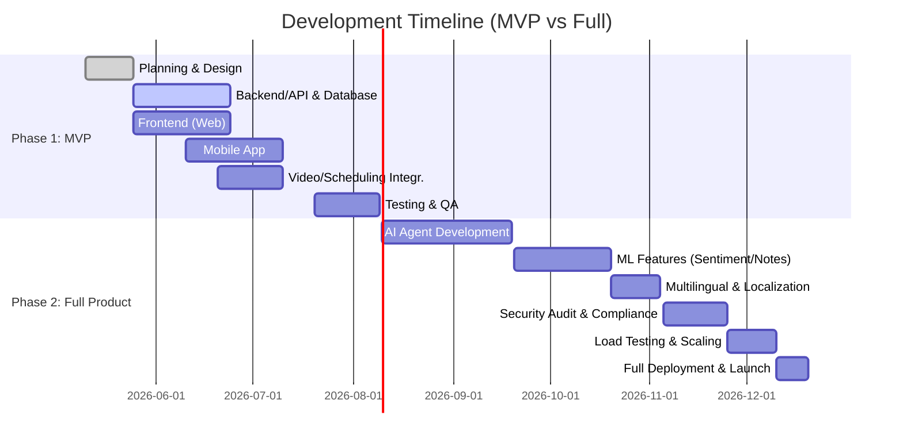

# Executive Summary

We propose building a comprehensive teletherapy/wellness platform incorporating **all Takalam features** (licensed counselor matching, scheduling, video sessions, mood tracking, content, and AI companion) plus advanced **AI agents** and integrations. Clients will find and book counselors via web or mobile, track their mood, and chat with an AI support bot (“Aila”) 24/7. Therapists will manage profiles, schedules, and sessions. The system will use scalable cloud infrastructure with end-to-end encryption and HIPAA/GDPR safeguards. Key AI components include a **customer support chatbot**, **appointment-scheduling agent**, **therapist recommendation engine**, **session sentiment analyzer**, and **automatic session summarizer**, all supporting multiple languages and privacy-preserving ML techniques. Third-party services (e.g. Stripe/PayPal for payments, Google/Outlook Calendars, Zoom/Twilio for video, Twilio SendGrid for email/SMS, analytics) will be integrated. We outline personas, user flows, a detailed feature inventory (with Takalam parity), a logical data model (ER diagram), system architecture, AI strategy (models vs APIs), compliance measures, and an implementation roadmap with a Gantt chart. Throughout, we cite authoritative sources for best practices in telehealth design, security, and AI.

## Feature Inventory and Parity

**Existing Takalam features:** Takalam offers a vetted network of **licensed counselors** (profiles with languages, specialties, reviews, hourly rates)【6†L38-L43】【10†L377-L381】, a **24/7 AI chat companion (Aila)** in English and Arabic【6†L38-L43】【10†L390-L394】, guided **meditation and learning content**【6†L38-L43】【10†L401-L404】, and **user tools** like daily **mood check-ins** with insights【10†L366-L370】. All interactions occur in a **private, encrypted space**【6†L38-L43】. Takalam also provides a **self-assessment** quiz and mobile apps for iOS/Android.

We will match Takalam’s functionality and add enhancements (summarized in the table below). For example, we will extend AI support beyond two languages, add intelligent filtering/auto-matching of therapists, build proactive appointment reminders, and incorporate richer analytics.  

| **Feature**                  | **Takalam (Yes/No & Details)**                                                            | **Our App (Enhancements)**                                                                                                                                              |
|------------------------------|-------------------------------------------------------------------------------------------|-------------------------------------------------------------------------------------------------------------------------------------------------------------------------|
| Licensed Counselor Directory | Yes – searchable profiles (languages, specialties) with availability and bookings【10†L377-L381】. | ✓ All Takalam features plus advanced **AI matching** (see below), dynamic filters (e.g. insurance, demographics), and real-time availability updates.                   |
| AI Chat Companion            | Yes – “Aila” 24/7 well-being chatbot in English/Arabic【6†L38-L43】【10†L390-L394】.           | ✓ Bilingual expanded to **multilingual support** (e.g. Urdu, Hindi, others), domain-specific training, sentiment-aware responses.                                         |
| Session Scheduling           | Yes – in-app booking with pricing (credits/Stripe)【10†L377-L381】.                           | ✓ Self-service scheduling plus an **AI booking agent** that can handle booking requests via chat/email, automatically find open slots, and reschedule appointments.     |
| Video & Messaging Sessions   | Yes – secure video sessions (HIPAA-grade) and messaging, encrypted end-to-end.             | ✓ Similar secure video (e.g. WebRTC/Twilio) with automated logging and **session summarization**. Also, optional **text chat** during video sessions.                      |
| Payment Processing           | Yes – credit card payments through Stripe/others (not HIPAA, only for billing)【44†L107-L114】. | ✓ Support Stripe/PayPal for convenience; ensure PHI is never sent to payment providers【44†L107-L114】. Optionally integrate local MENA gateways (e.g. Tabby, Payfort).   |
| Mood Tracking / Check-ins    | Yes – daily check-ins with progress graphs【10†L366-L370】.                                 | ✓ Enhanced mood analytics (trend charts, mood triggers) and **emotion-sensing** (via sentiment analysis on journal entries) for proactive wellbeing alerts.              |
| Content & Articles           | Yes – blog articles and Ramadan tips【10†L401-L404】.                                       | ✓ Expanded content library (videos, tutorials), personalized content recommendations using AI. Push notifications for new content.                                       |
| Multilingual Support         | Partial – English and Arabic interfaces.                                                 | ✓ Full internationalization: UI localization and multilingual AI (translation/counseling in 10+ languages) to serve a broader user base.                                 |
| Data Privacy & Security      | High – private encrypted storage; ADGM/UAE data protection【14†L43-L49】.                  | ✓ Follow HIPAA/GDPR best practices (see Security section). End-to-end encryption for media【25†L399-L407】【48†L157-L161】, strong auth, audit logs, and user data rights. |

The above table summarizes feature parity and planned enhancements. We will also implement additional features such as **group therapy sessions**, **progress assessments**, and **organizational dashboards** for employers, if needed.

## User Personas and User Flows

We identify three main personas:

- **Client (End-User):** An adult seeking support (e.g. stressed student or working professional). The client signs up (email/phone verification), optionally takes a **wellness assessment quiz**, then searches/browses counselors. They can filter by language, issue, price, and availability. Upon finding a match, they **book a session** (select time slot, pay). They receive reminders (email/SMS) and join the session via secure video link. During off-hours, the client can chat with the AI companion about everyday issues. They also log daily **mood check-ins** (via an app UI) and read articles or guided meditations. After a session, they get a session summary (if they consent to AI notes) and may rate the counselor. Flow steps:  
  1. **Sign Up/Login** – enter profile & preferences.  
  2. **Assessment** – complete optional mental health self-assessment.  
  3. **Find Counselor** – filter/list counselors, view profiles.  
  4. **Book Session** – schedule via calendar, complete payment. (Automated email/SMS confirmation.)  
  5. **Attend Session** – join video call or chat at scheduled time.  
  6. **Between Sessions** – use Aila chatbot, track mood, view content.  
  7. **Follow-up** – receive summary/notes, rate session, schedule next.

- **Therapist/Counselor:** A licensed counselor profile is invited or self-signs up. The counselor completes an onboarding questionnaire (qualifications, specialties, languages, hourly rate). They connect their calendar (or set availability) and can accept/decline sessions. When booked, they are notified. During a session, the counselor sees client info (issues, notes) and can enter session notes afterwards. They receive payouts (via Stripe/PayPal). Flow:  
  1. **Onboarding:** Fill out credentials and documents (verified by admin).  
  2. **Profile Setup:** Select specialties (e.g. Anxiety, Depression), languages, bio, and set hourly rate.  
  3. **Availability:** Define open time slots or sync with Google/Outlook Calendar.  
  4. **Client Session:** Conduct video or chat session at scheduled time.  
  5. **Post-Session:** Fill in notes or accept AI-generated summary, close appointment.  
  6. **Payout/Calendar:** Get paid via integrated gateway, view upcoming schedule.  

- **Administrator:** Internal staff manage the platform. They review new counselor applications, moderate content (articles, meditation tracks), handle support tickets, and monitor usage analytics (sessions per week, revenue). They enforce compliance (audit logs, data retention). Flow:  
  1. **User Management:** Approve/reject counselor signups, audit client accounts if needed.  
  2. **Content Management:** Publish/edit educational content, manage AI chatbot knowledgebase.  
  3. **Analytics & Reporting:** View metrics (user engagement, no-show rates, income).  
  4. **Compliance:** Ensure BAA agreements are in place with vendors; verify encryption and logs.  
  5. **Support:** Answer user/counselor inquiries via ticketing system.

## Data Model and ER Diagram

Key entities include **User** (with roles client or counselor), **CounselorProfile** (extended info), **Appointment** (session bookings), **Payment/Transaction**, **Message/Chat** logs, **CheckIn** (mood entries), **Content** (articles, meditations), **Specialty** and **Language** (lookup tables), and **Role** (admin rights). Relationships: Users can have many appointments; each appointment links one client and one counselor; payments link to appointments; chats link to users (client/AI or client/counselor). The ER diagram below (Mermaid) captures these relationships:



This diagram illustrates that each **Appointment** ties a client user to a counselor profile, with an associated payment. **Messages** (text chat or AI logs) connect users and appointments. We use associative tables (not shown) for many-to-many (e.g. counselor specialties).

## System Architecture

The system will be a **scalable multi-tier architecture**. The **frontend** will include a web app (React/Next.js) and mobile apps (React Native or Flutter). Both client and counselor apps communicate via HTTPS to a **Backend API server** (e.g. Node.js/Express or Django) that enforces business logic. Core backend components include an **Auth Service** (JWT/OAuth 2.0), **AI Services** (chatbot, ML models via separate microservices or serverless functions), a **Real-Time Service** (WebSocket/SFU for live chat and video signaling), and a **Notification Service** (sending push/email/SMS alerts). The **database** (e.g. PostgreSQL with encryption-at-rest) stores user, session, and content data. A high-level architecture (Mermaid) is shown below:



All communications use TLS. Video calls use a secure WebRTC (preferably E2EE) or HIPAA-ready API (e.g. Twilio Video with App Token, or self-hosted Jitsi). The AI engine may use separate containerized microservices or external APIs (see below). Monitoring (e.g. Prometheus/Grafana or New Relic) observes system health and scaling (auto-scale via Kubernetes or cloud autoscaling). Continuous integration/deployment pipelines (GitHub Actions/CircleCI) automate testing and cloud deployment.

## AI Components

We propose the following AI agents:

- **Customer Support Agent (Chatbot):** A conversational AI assistant (“Aila-like”) that answers user questions, provides coping strategies, and triages common issues. This may be based on a large language model (LLM) fine-tuned on mental health dialogues, or an LLM enhanced with a knowledge base. The bot should handle FAQs, crisis coping, and gentle guidance, escalating to human help if needed. It must support multiple languages and comply with HIPAA (no storage of PHI beyond session context).  
- **Booking Agent:** An NLU-driven agent that can interpret user intent to book or change appointments. For example, a user could say “I want to see a female counselor for stress next week” and the AI checks availability and schedules. This could be built with a dialogue flow (Rasa or AI LLM) integrated with the scheduling API. It should send confirmation/reminders automatically【37†L47-L49】【35†L247-L250】.  
- **Therapist Matching/Recommendation:** An AI module (either rule-based or ML) that suggests therapists based on user-input symptoms, preferences, and past outcomes【29†L139-L142】【29†L156-L158】. For instance, by analyzing a client’s profile and concerns, the system ranks counselors. We could use a hybrid approach: a machine learning model (collaborative filtering) supplemented by an LLM that interprets nuance (e.g. “Based on anxiety and sleep issues, we suggest Dr. X because…”). Recent research shows LLMs can **interpret nuanced client descriptions and match them with therapists**【29†L139-L142】【29†L156-L158】.  
- **Sentiment Analysis:** Automatic analysis of conversation or journal text to gauge emotional state【40†L53-L57】. For example, tracking sentiment trends can alert a therapist to a client’s emotional distress. This uses NLP models (BERT/RoBERTa variants) to classify text as positive/negative/neutral or label emotions【40†L53-L57】. In-session, a live sentiment dashboard (per [40]) can highlight spikes in distress.  
- **Session Summarization:** Post-session, an AI model (LLM or specialized summarizer) transcribes and summarizes the key points and action items of a therapy session【42†L61-L65】. Consent is required (e.g. per Grow Therapy’s design)【42†L61-L65】【42†L79-L82】. The summary is encrypted and HIPAA-protected【42†L79-L82】. It saves therapist time and keeps clients engaged (they can receive a write-up of their session via the app【42†L130-L137】).  
- **Multilingual Support:** All AI agents and user interfaces will support multiple languages (English, Arabic, Urdu, etc.). This means using LLMs or translation models to process and generate text in the user’s language. For example, the chatbot will detect language and respond in kind, and session summaries can be translated. A recent claim is that multilingual LLMs can extend mental health support across languages with high accuracy.  
- **Privacy-Preserving ML:** We will train any models on anonymized or federated data where possible. Sensitive inputs (mental health details) should not be logged outside the session. Techniques like differential privacy or on-device inference can be considered to ensure models do not memorize PHI【42†L79-L82】. For example, follow Grow Telehealth’s approach: “the third-party providers we use for processing do not store or train on this data”【42†L139-L144】.

**AI Model Choices:** We must choose between on-premise/open-source models vs. hosted APIs. For each AI feature:

| **Component**          | **Task**                         | **Open-Source Option**               | **Hosted/API Option**             | **Trade-Offs**                             |
|------------------------|----------------------------------|--------------------------------------|-----------------------------------|--------------------------------------------|
| **Chatbot (customer)** | Conversational support (dialog)  | GPT-NeoX, LLaMA 2 (self-host on GPU) | GPT-4/Claude via API             | API models have best quality but cost per call; open models reduce cost but need infra and may be less fluent. Self-hosting protects data. |
| **Booking Agent**      | NLU intent classification       | Rasa or Dialogflow (open)            | LLM with fine-tuned prompts      | Hosted LLM (e.g. GPT-4) simplifies NLU but is a black box; Rasa gives full control and on-premises HIPAA. |
| **Therapist Matching** | Recommendation (classification) | Custom Python (Scikit-learn)         | OpenAI Embeddings + GPT-4        | In-house ML (e.g. matrix factorization) is low-cost but requires data; GPT-based can add nuance but costs more. |
| **Sentiment Analysis** | Text emotion classification     | BERT/RoBERTa models (HuggingFace)     | OpenAI (moderation endpoints)     | Open-source allows local inference; APIs may have better language support. Must ensure HIPAA data handling. |
| **Summarization**      | LLM summarization of text       | LLaMA2, Flan-T5 (fine-tuned)         | GPT-4 Turbo                       | GPT-4 achieves highest fidelity summaries; open models can do basic summaries with some tuning. |
| **Multilingual NLP**   | Translation and NLP             | mBERT, M2M100                        | GPT-4 (supports many langs)       | APIs offer many languages out-of-box; open models may not cover dialects or require more work. |
| **Voice/NLU (optional)** | Speech-to-text & intent      | Vosk, Deepspeech + on-device NLP     | Whisper API, Azure Speech         | On-prem STT ensures no PHI leaves device; cloud services have better accuracy.

This table shows that **open-source models** (Llama, BERT, etc.) can run on our infrastructure (ensuring data control), while **hosted APIs** (OpenAI/Anthropic/Microsoft) offer cutting-edge performance at a usage cost. We may adopt a hybrid: for example, initial PoC with APIs, then move critical or sensitive parts to self-hosted models. All AI endpoints must respect data privacy (e.g. not storing transcripts after use)【42†L79-L82】.

## Third-Party Integrations

To build core functionality, we will integrate proven third-party services:

- **Payment Gateways:** Stripe (widely used) and/or PayPal for online payments; note that **Stripe itself is not HIPAA-compliant** beyond payment processing【44†L107-L114】, so we will only send transaction metadata (no PHI) to it. For MENA users, consider local providers like Tabby or PayFort if needed. 
- **Calendar/Scheduling:** Google Calendar API and Microsoft Outlook/Graph API to sync appointments and reminders (users can optionally link their personal calendars). These APIs are robust and popular for scheduling.
- **Video Conferencing:** Options include Zoom, Twilio Programmable Video, or Jitsi. Each can sign a HIPAA BAA【48†L139-L144】. Zoom is easy but end-to-end encryption requires paid plans; Twilio Video has HIPAA support (we can sign a BAA) and gives developer control; Jitsi is open-source (can self-host to ensure full E2EE【25†L399-L407】).  
- **SMS/Telephony:** Twilio (programmable SMS/voice) or Vonage (Nexmo) for appointment reminders and two-factor auth. Twilio will sign a BAA and is reliable. We will use these only for SMS/voice metadata, not PHI.  
- **Email:** Services like SendGrid or AWS SES can send transactional emails (meeting links, notifications). These platforms offer security features; with a BAA, they can be HIPAA-compliant for email notifications.  
- **Analytics/Monitoring:** Google Analytics or Mixpanel for usage metrics (we must anonymize personal data for GDPR). For deeper health analytics, tools like Segment or Amplitude could be used. For system monitoring, services like Datadog or AWS CloudWatch will be used.  
- **Others:** Potential EHR integration (HL7/FHIR) if health insurers are involved. For simplicity, initial launch will focus on core integrations above.

A comparison table:

| **Category**             | **Example Providers**          | **Pros**                                                      | **Cons/Notes**                                                                                  |
|--------------------------|--------------------------------|---------------------------------------------------------------|-------------------------------------------------------------------------------------------------|
| Payment Gateways         | Stripe, PayPal, Tabby         | Easy integration, global support                             | Not HIPAA-ready beyond billing; no PHI in payload【44†L107-L114】.                               |
| Video Conferencing       | Twilio Video, Zoom, Jitsi     | Twilio/Zoom sign BAA, high quality; Jitsi is free/E2EE capable | Zoom E2EE limited; Twilio costs per user; Jitsi requires self-hosting/maintenance.             |
| SMS/Voice                | Twilio, Vonage (Nexmo)        | Reliable, global; Twilio HIPAA-eligible                       | Costs per message; no PHI (only use for codes/alerts).                                          |
| Email                    | SendGrid, AWS SES             | Scalable, supports SMTP API, BAA available                    | Must secure templates (no PHI), and comply with spam laws.                                      |
| Calendar/Collaboration   | Google Calendar API, Outlook  | Ubiquitous user base, OAuth support                           | Requires user consent for calendar access.                                                     |
| Push Notifications       | Firebase Cloud Messaging (FCM) | Free, cross-platform push                                    | No PHI by default, but notifications must be generic.                                          |
| Analytics/Logging        | Google Analytics, Matomo, Datadog | GA is free/popular; Matomo self-host improves privacy; Datadog for infra monitoring | GA has privacy concerns (GDPR), Matomo needs hosting; analytics won’t hold PHI (use anonymized IDs). |

Each provider will be used according to its strengths: e.g. Twilio for SMS, Google Calendar for scheduling, Stripe for payments, etc. All are well-documented and scalable.

## Security & Compliance

Because this app handles **mental health data (PHI)**, we must comply with HIPAA (if servicing US/EU clients) and GDPR/ADGM (for Dubai/EU). Key measures include:

- **Data Encryption:** End-to-end encryption (E2EE) on all live communications. For video calls, we will use WebRTC with insertable streams (as in a HIPAA telehealth project) so the server cannot decrypt media【25†L399-L407】. Transport Layer Security (TLS 1.2+) will protect all APIs. Data at rest (databases, file storage) will use strong encryption (AES-256) and encrypted volumes. For example, an SFU architecture adding an application-layer AES-256 E2EE ensures our servers *never see plaintext video/audio*【25†L399-L407】【48†L157-L161】.  
- **Access Controls:** Robust authentication (OAuth 2.0/JWT with MFA) and **role-based/attribute-based access control (RBAC/ABAC)**. Staff and therapists get only the permissions they need (e.g. a therapist can only access her own clients’ sessions). Audit logging is mandatory: every access to PHI (appointment records, messages) will be logged in a tamper-evident audit log【25†L420-L424】. For HIPAA, at least 7 years of retention is typical, but GDPR allows “right to be forgotten”【16†L19-L27】【25†L420-L424】. We will design data retention to satisfy both (e.g. anonymize old records if deletion requested).  
- **Business Associate Agreements:** Any cloud or service provider handling PHI (e.g. AWS, Twilio) will sign a BAA【48†L139-L144】【46†L153-L161】. We will use HIPAA-eligible AWS services (EC2, S3, RDS with encryption, etc.) under a BAA【46†L153-L161】. Where HIPAA does not apply (e.g. local UAE law ADGM), we still enforce similar safeguards (consent, minimal data). The privacy policy explicitly notes UAE/ADGM user rights (access, rectify, delete)【14†L43-L49】, and we will implement GDPR-style consent management for EU users.  
- **Infrastructure Security:** VPC isolation, firewalls, and least-privilege IAM. For example, use HTTPS only, disable public DB access, and use API gateways. Regular vulnerability scans and patching (DevSecOps).  
- **AI Data Handling:** Any AI inputs/outputs that involve user content will also be treated as PHI. We will follow Takalam’s model: “we may collect AI inputs/outputs ... to provide requested functionality”【20†L267-L274】 but ensure they are encrypted and not used for unrelated training. Like Grow Telehealth, AI summaries **will be encrypted and not stored by external providers**【42†L79-L82】【42†L139-L144】. Consent will be obtained before any session transcription/summarization.  
- **Audit and Monitoring:** Implement automated logging (e.g. write-once logs, cryptographic chaining) so that any tampering triggers alerts【25†L426-L434】. Regular compliance audits (HITRUST/ISO 27001) and penetration tests will be scheduled. In sum, security is built as a *foundation* not an afterthought【25†L325-L328】.

## Deployment & Scalability

We will deploy on a cloud platform with BAA (e.g. AWS, Azure, or GCP). Cloud-native best practices include containerizing services (Docker, Kubernetes/EKS) for microservices (API, AI, real-time, etc.). Auto-scaling groups and a load balancer will handle traffic spikes (especially given scheduled sessions). CI/CD pipelines (GitHub Actions/Jenkins) will automate testing and deployment, with infrastructure as code (Terraform) for reproducible environments. Monitoring (Prometheus/Grafana or Datadog) will track performance (CPU, memory, latency) and set alerts. We also pre-warm compute before peak hours (e.g. 30 min before a surge【25†L336-L339】) to avoid cold-start delays, as telehealth sessions are often on-demand or pre-scheduled. Disaster recovery plans (multi-region database replication, daily backups) will ensure minimal downtime. 

**Infrastructure choices:** AWS provides HIPAA-eligible services (EC2, RDS, Kinesis, etc.) with a BAA【46†L153-L161】. For example, we might use AWS RDS (Postgres) for data, S3 (encrypted) for file storage, and EKS for orchestration. Alternatively, a multi-cloud approach or Kubernetes on-prem could be used if stricter data residency is needed. We will budget for cloud costs: anticipate needing 2-3 medium instances (for web/API), GPUs for ML inference, plus managed services (RDS, S3, Redis, etc.). Detailed cost modeling depends on load, but we should assume **non-trivial infrastructure costs** for video and AI (hundreds to thousands USD/month at scale).

## Cost Estimates and Timeline

Development can be phased in **MVP vs Full**:

- **MVP (core teletherapy app):** ~4–6 months with a small team (e.g. 2 frontend, 2 backend devs, 1 UI/UX designer, 1 QA). Includes user accounts, counselor directory/search, scheduling, payments, video chat, mood tracking, basic content. Rough cost: \$100–150K (depending on region; e.g. mid-US dev rates).  
- **Full Product (enhanced AI):** Additional ~3–4 months to integrate AI agents, analytics, and advanced features (sentiment, summarization, multilingual support, admin portal, scalability improvements). Additional dev resources (AI/ML engineers) raise cost to \$200–250K total.

Below is an illustrative timeline (Mermaid Gantt):



By end of **Q4 2026**, a fully featured app could be launched. Costs include developer salaries, cloud hosting (~\$2–5K/month), and third-party fees (Stripe transaction fees, Twilio SMS, etc.).

## Tech Stack Options and Trade-offs

We recommend modern, popular stacks for productivity and community support:

- **Frontend/Web:** *React* (JavaScript/TypeScript) or *Vue*. React is widely adopted with many UI libraries; Angular is another option but heavier. We may use Next.js for server-side rendering if SEO is a concern (for the marketing site).  
- **Mobile:** *React Native* or *Flutter*. React Native shares code with web (if React is chosen). Flutter (Dart) gives excellent performance and cross-platform UI. Both have mature ecosystems.  
- **Backend:** *Node.js/Express* or *NestJS* for JavaScript full-stack, or *Python/Django* for rapid development (strong ML integration). Node.js offers a unified language and excellent WebSocket support for real-time. Python has rich data libraries. We could also use *Go* or *Java* for performance, but those have steeper learning.  
- **Database:** *PostgreSQL* (relational) is a safe choice for transactional data (appointments, users). We can use *Redis* for caching or pub/sub in real-time chat. A NoSQL DB (MongoDB) is an alternative for flexible schema (counselor profiles, logs), but we prefer SQL for consistency in healthcare data.  
- **Real-time/Video:** We will use *WebSockets* (e.g. Socket.IO) for chat signals and integrate a WebRTC SFU for video. Twilio or Jitsi clients can plug into our front-end.  
- **AI/ML:** Python (PyTorch, TensorFlow) will be used for any custom model training. For production inference, models could run in Python microservices or be accessed via REST.  
- **DevOps:** *Docker* for containers, *Kubernetes* for orchestration (auto-scaling). CI/CD with GitHub Actions/Jenkins. Monitoring: *Prometheus/Grafana* or managed solutions.  

**Trade-offs:** Using open-source tech (React, Node, Postgres) avoids vendor lock-in and licensing fees. Proprietary/BaaS (Firebase Auth, AWS Amplify, etc.) can accelerate development but may limit customization. We will avoid vendor-locked PaaS where possible, preferring cloud-agnostic Docker deployments.  

## Testing Strategy

Comprehensive testing will ensure reliability: 

- **Unit Tests:** For all backend and frontend logic (using Jest, Mocha, or PyTest). 
- **Integration Tests:** API endpoints tested with Postman/Newman or Supertest to verify workflows (e.g. booking a session end-to-end). 
- **End-to-End (E2E):** Automated UI tests (Cypress or Selenium) simulate user flows (signup, booking, chat).
- **Performance Tests:** Load testing (JMeter, k6) to ensure video and APIs scale under 1000s of concurrent users. 
- **Security Tests:** Static code analysis (ESLint, Bandit) and dynamic pentesting (OWASP ZAP). Verify encryption, no PHI leakage, proper auth. 
- **AI Validation:** For AI agents, we will test a suite of prompts and expected behaviors. We’ll use manual review by clinicians on generated summaries and chatbot responses to catch biases or errors. 
- **Compliance Check:** Verify data retention, consent screens, and encryption meet HIPAA/GDPR rules.  

## Risks and Mitigations

- **Data Breach Risk:** High sensitivity of mental health data demands strong safeguards. Mitigation: E2EE, strict BAAs, network isolation, and regular audits (see Security). 
- **AI Reliability & Bias:** AI chatbots might give incorrect or biased advice. Mitigation: restrict AI to supportive, evidence-based replies and provide emergency escalation (hotline link). Maintain human oversight. Regularly update models with diverse data. 
- **Regulatory Changes:** Privacy laws may evolve (e.g. new UAE rules). Mitigation: design flexible data policies; legal counsel; log all processing to adapt quickly. 
- **Scalability Challenges:** Video calls can overload servers. Mitigation: use SFU (not MCU) for calls as suggested【25†L399-L407】, and auto-scale with predictive scheduling (warm-up before peak)【25†L336-L339】. 
- **Third-Party Dependence:** If Stripe/Vendor policies change, payments or communications could fail. Mitigation: support multiple gateways/providers as backup. 
- **User Adoption:** Teletherapy uptake depends on trust. Mitigation: Emphasize privacy (“your data is encrypted”【6†L38-L43】) and gather feedback through MVP pilots with local partners. 

## Sample Claude Code Prompts

Below are example prompts for using an AI code-generation model (e.g. Claude Code) and for interacting with AI agents:

- **App Code Generation Prompt:**  
  ```
  "Generate a full-stack wellness app codebase with the following features: user registration and authentication (email/phone, OTP), client and therapist roles, profiles (qualifications, specialties, languages), appointment booking with payment (Stripe), video session integration (WebRTC), a daily mood-tracking feature, and an AI chatbot for mental health support. Use React (web) and React Native (mobile) for frontends, Node.js/Express for backend, and PostgreSQL as the database. Ensure JWT auth, TLS security, and scalability. Provide project structure and key code snippets."
  ```
- **API Specification Prompt:**  
  ```
  "Write an OpenAPI (Swagger) specification for the teletherapy app API. Include endpoints: POST /signup, /login, /counselors (GET list, filters), /bookings (create/cancel), /payments (webhook), /sessions (start/stop), /chat (send/receive), /checkins (create/view), and AI endpoints (/ai/chat, /ai/match). Define models for User, Counselor, Appointment, and messages."
  ```
- **Customer Support Agent Prompt:**  
  ```
  Customer: "Hello, I've been feeling anxious about work and can't sleep. What can I do right now?"  
  AI Agent: "I'm sorry to hear you're feeling anxious. Try some deep breathing exercises right now. Would you like to talk about what's on your mind or schedule a session with a counselor?"  
  ```
- **Booking Agent Prompt:**  
  ```
  User: "I want to book an appointment with a counselor who speaks Arabic about anxiety, sometime next week."  
  Agent: "Sure. We have Arabic-speaking counselors available. Let me check next week's schedule..."  
  ```
- **Therapist Matching Prompt:**  
  ```
  "Based on a user profile: Female, 30 years old, issues: chronic stress and insomnia, prefers a female counselor. Recommend the top 3 counselor matches with reasons."  
  ```
- **Sentiment Analysis Prompt:**  
  ```
  "Analyze the sentiment of the following client message: 'I felt really down this week, but talking to my counselor helped a bit, though I'm still quite anxious.' Provide the emotion and positivity/negativity score."
  ```
- **Session Summarization Prompt:**  
  ```
  "Summarize this therapy conversation: [Transcript text]. Highlight the client's main concerns and the therapist's suggestions in bullet points."
  ```
- **Multilingual Support Prompt:**  
  ```
  "Translate and respond in Arabic: 'I am feeling anxious and overwhelmed. Can you help me calm down?'"  
  ```
- **Privacy-Preserving ML Prompt:**  
  ```
  "Explain how to train a client-chatbot model using differential privacy so that no individual session data can be reconstructed from the trained model."
  ```

Each of these prompts guides an AI (Claude or similar) to perform coding tasks or emulate the desired AI agent behavior.

**Sources:** Takalam platform features【6†L38-L43】【10†L377-L381】; AI matching research【29†L139-L142】【29†L156-L158】; HIPAA/security best practices【25†L399-L407】【25†L420-L424】【44†L107-L114】【48†L157-L161】【42†L79-L82】. These inform our design and requirements.