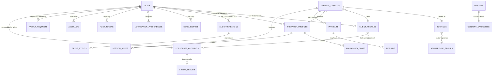

# Data Model — GCC Wellness Platform

**Database:** PostgreSQL 16
**ORM:** SQLAlchemy 2.x with Alembic migrations
**Conventions:**
- All primary keys: UUID (`gen_random_uuid()`)
- All timestamps: `TIMESTAMPTZ` (UTC stored; converted to user timezone at API layer)
- Soft deletes: `deleted_at TIMESTAMPTZ NULL` — excluded from all application queries via global filter
- PHI columns: noted explicitly; encrypted at application layer (AES-256) before storage
- Append-only tables: `audit_log`, `crisis_events` — `UPDATE` and `DELETE` revoked at DB level

---

## Entity Relationship Diagram



---

## Table Definitions

### `users`
Core identity table for all roles.

```sql
CREATE TABLE users (
    id                  UUID PRIMARY KEY DEFAULT gen_random_uuid(),
    email               TEXT NOT NULL UNIQUE,
    hashed_password     TEXT,                          -- NULL for SSO-only accounts
    full_name           TEXT NOT NULL,
    role                TEXT NOT NULL CHECK (role IN ('client','therapist','hr_admin','platform_admin')),
    preferred_language  TEXT NOT NULL DEFAULT 'en' CHECK (preferred_language IN ('ar','en')),
    timezone            TEXT NOT NULL DEFAULT 'Asia/Dubai',
    totp_secret         TEXT,                          -- NULL until 2FA setup
    totp_confirmed      BOOLEAN NOT NULL DEFAULT FALSE,
    google_sub          TEXT UNIQUE,                   -- Google OAuth2 subject ID
    is_safety_officer   BOOLEAN NOT NULL DEFAULT FALSE, -- Sub-role for platform_admin
    created_at          TIMESTAMPTZ NOT NULL DEFAULT NOW(),
    updated_at          TIMESTAMPTZ NOT NULL DEFAULT NOW(),
    deleted_at          TIMESTAMPTZ                    -- Soft delete; triggers 30-day purge job
);

CREATE INDEX idx_users_email ON users(email);
CREATE INDEX idx_users_role ON users(role);
CREATE INDEX idx_users_deleted_at ON users(deleted_at) WHERE deleted_at IS NULL;
```

---

### `client_profiles`
Extended data for `role=client` users. One-to-one with `users`.

```sql
CREATE TABLE client_profiles (
    user_id                 UUID PRIMARY KEY REFERENCES users(id) ON DELETE CASCADE,
    intake_data             BYTEA,                     -- PHI: AES-256 encrypted JSONB
    mood_tracking_enabled   BOOLEAN NOT NULL DEFAULT TRUE,
    therapist_mood_access   BOOLEAN NOT NULL DEFAULT FALSE,
    corporate_id            UUID REFERENCES corporate_accounts(id) ON DELETE SET NULL,
    onboarding_completed_at TIMESTAMPTZ,
    created_at              TIMESTAMPTZ NOT NULL DEFAULT NOW(),
    updated_at              TIMESTAMPTZ NOT NULL DEFAULT NOW()
);
```

---

### `therapist_profiles`
Extended data for `role=therapist` users. One-to-one with `users`.

```sql
CREATE TABLE therapist_profiles (
    user_id                     UUID PRIMARY KEY REFERENCES users(id) ON DELETE CASCADE,
    license_number              TEXT NOT NULL,
    license_authority           TEXT NOT NULL CHECK (license_authority IN ('DHA','SCFHS','MOH','HAAD','other')),
    license_verified_at         TIMESTAMPTZ,
    license_document_url        TEXT,                  -- Cloudflare R2 signed URL
    malpractice_insurance_url   TEXT,                  -- Cloudflare R2 signed URL
    verified_by_admin_id        UUID REFERENCES users(id),
    specializations             TEXT[] NOT NULL DEFAULT '{}',
    languages                   TEXT[] NOT NULL DEFAULT '{"en"}',
    session_price_aed           INTEGER NOT NULL,
    session_duration_minutes    INTEGER NOT NULL DEFAULT 50,
    bio                         TEXT,
    avatar_url                  TEXT,
    rating                      NUMERIC(3,2) NOT NULL DEFAULT 0.00,
    review_count                INTEGER NOT NULL DEFAULT 0,
    status                      TEXT NOT NULL DEFAULT 'pending'
                                    CHECK (status IN ('pending','active','suspended','removed')),
    probation_sessions_remaining INTEGER NOT NULL DEFAULT 5,
    created_at                  TIMESTAMPTZ NOT NULL DEFAULT NOW(),
    updated_at                  TIMESTAMPTZ NOT NULL DEFAULT NOW()
);

-- Embedding vector for AI matching (pgvector extension)
ALTER TABLE therapist_profiles ADD COLUMN specialization_embedding VECTOR(1536);

CREATE INDEX idx_therapist_status ON therapist_profiles(status);
CREATE INDEX idx_therapist_languages ON therapist_profiles USING GIN(languages);
CREATE INDEX idx_therapist_specializations ON therapist_profiles USING GIN(specializations);
CREATE INDEX idx_therapist_embedding ON therapist_profiles USING ivfflat(specialization_embedding vector_cosine_ops);
```

---

### `availability_slots`
Therapist availability definitions (both recurring and one-off).

```sql
CREATE TABLE availability_slots (
    id              UUID PRIMARY KEY DEFAULT gen_random_uuid(),
    therapist_id    UUID NOT NULL REFERENCES therapist_profiles(user_id) ON DELETE CASCADE,
    day_of_week     SMALLINT CHECK (day_of_week BETWEEN 0 AND 6),  -- NULL for specific date
    start_time      TIME NOT NULL,
    end_time        TIME NOT NULL,
    timezone        TEXT NOT NULL DEFAULT 'Asia/Dubai',
    is_recurring    BOOLEAN NOT NULL DEFAULT TRUE,
    specific_date   DATE,                              -- NULL for recurring slots
    is_blocked      BOOLEAN NOT NULL DEFAULT FALSE,
    created_at      TIMESTAMPTZ NOT NULL DEFAULT NOW(),
    CONSTRAINT chk_slot_type CHECK (
        (is_recurring = TRUE AND day_of_week IS NOT NULL AND specific_date IS NULL) OR
        (is_recurring = FALSE AND specific_date IS NOT NULL)
    )
);

CREATE INDEX idx_slots_therapist ON availability_slots(therapist_id);
CREATE INDEX idx_slots_date ON availability_slots(specific_date) WHERE specific_date IS NOT NULL;
CREATE INDEX idx_slots_recurring ON availability_slots(therapist_id, day_of_week) WHERE is_recurring = TRUE;
```

---

### `therapy_sessions`
Core session record created when a booking is confirmed.

```sql
CREATE TABLE therapy_sessions (
    id                      UUID PRIMARY KEY DEFAULT gen_random_uuid(),
    client_id               UUID NOT NULL REFERENCES client_profiles(user_id),
    therapist_id            UUID NOT NULL REFERENCES therapist_profiles(user_id),
    scheduled_at            TIMESTAMPTZ NOT NULL,
    duration_minutes        INTEGER NOT NULL DEFAULT 50,
    status                  TEXT NOT NULL DEFAULT 'scheduled'
                                CHECK (status IN ('scheduled','in_progress','completed','cancelled','interrupted')),
    agora_channel_id        UUID UNIQUE,               -- Unique per session
    price_aed               INTEGER NOT NULL,
    platform_fee_aed        INTEGER NOT NULL,          -- 30% of price_aed
    therapist_payout_aed    INTEGER NOT NULL,          -- 70% of price_aed
    recording_consent_client    BOOLEAN NOT NULL DEFAULT FALSE,
    recording_consent_therapist BOOLEAN NOT NULL DEFAULT FALSE,
    interrupted_at          TIMESTAMPTZ,
    cancelled_at            TIMESTAMPTZ,
    cancellation_reason     TEXT,
    refund_issued           BOOLEAN NOT NULL DEFAULT FALSE,
    session_rating          SMALLINT CHECK (session_rating BETWEEN 1 AND 5),
    session_started_at      TIMESTAMPTZ,               -- Time first participant joined
    session_ended_at        TIMESTAMPTZ,
    extension_used          BOOLEAN NOT NULL DEFAULT FALSE,
    created_at              TIMESTAMPTZ NOT NULL DEFAULT NOW(),
    updated_at              TIMESTAMPTZ NOT NULL DEFAULT NOW()
);

CREATE INDEX idx_sessions_client ON therapy_sessions(client_id);
CREATE INDEX idx_sessions_therapist ON therapy_sessions(therapist_id);
CREATE INDEX idx_sessions_scheduled ON therapy_sessions(scheduled_at);
CREATE INDEX idx_sessions_status ON therapy_sessions(status);
```

---

### `bookings`
Booking request record. Created before payment; session created after payment confirms.

```sql
CREATE TABLE bookings (
    id                      UUID PRIMARY KEY DEFAULT gen_random_uuid(),
    session_id              UUID REFERENCES therapy_sessions(id),
    client_id               UUID NOT NULL REFERENCES users(id),
    therapist_id            UUID NOT NULL REFERENCES therapist_profiles(user_id),
    slot_id                 UUID REFERENCES availability_slots(id),
    booking_source          TEXT NOT NULL CHECK (booking_source IN ('ai_agent','calendar_ui')),
    corporate_credit_used   BOOLEAN NOT NULL DEFAULT FALSE,
    recurrence_group_id     UUID REFERENCES recurrence_groups(id),
    status                  TEXT NOT NULL DEFAULT 'pending_payment'
                                CHECK (status IN ('pending_payment','confirmed','cancelled')),
    timezone                TEXT NOT NULL,
    created_at              TIMESTAMPTZ NOT NULL DEFAULT NOW()
);

CREATE TABLE recurrence_groups (
    id              UUID PRIMARY KEY DEFAULT gen_random_uuid(),
    frequency       TEXT NOT NULL DEFAULT 'weekly',
    until_date      DATE,
    count           INTEGER,
    created_at      TIMESTAMPTZ NOT NULL DEFAULT NOW()
);

CREATE INDEX idx_bookings_client ON bookings(client_id);
CREATE INDEX idx_bookings_therapist ON bookings(therapist_id);
CREATE INDEX idx_bookings_slot ON bookings(slot_id);
```

---

### `payments`
Payment records tied to therapy sessions.

```sql
CREATE TABLE payments (
    id                  UUID PRIMARY KEY DEFAULT gen_random_uuid(),
    booking_id          UUID NOT NULL REFERENCES bookings(id),
    session_id          UUID REFERENCES therapy_sessions(id),
    client_id           UUID NOT NULL REFERENCES users(id),
    amount_aed          INTEGER NOT NULL,
    currency            TEXT NOT NULL DEFAULT 'AED',
    status              TEXT NOT NULL DEFAULT 'initiated'
                            CHECK (status IN ('initiated','processing','paid','failed','refunded')),
    tap_charge_id       TEXT UNIQUE,                   -- Tap Payments charge ID
    tap_webhook_event   TEXT,                          -- Last received event type
    paid_at             TIMESTAMPTZ,
    created_at          TIMESTAMPTZ NOT NULL DEFAULT NOW(),
    updated_at          TIMESTAMPTZ NOT NULL DEFAULT NOW()
);

CREATE TABLE refunds (
    id                  UUID PRIMARY KEY DEFAULT gen_random_uuid(),
    payment_id          UUID NOT NULL REFERENCES payments(id),
    amount_aed          INTEGER NOT NULL,
    refund_type         TEXT NOT NULL CHECK (refund_type IN ('tap_refund','platform_credit')),
    tap_refund_id       TEXT,
    reason              TEXT,
    status              TEXT NOT NULL DEFAULT 'processing'
                            CHECK (status IN ('processing','completed','failed')),
    created_at          TIMESTAMPTZ NOT NULL DEFAULT NOW()
);

CREATE TABLE credit_ledger (
    id              UUID PRIMARY KEY DEFAULT gen_random_uuid(),
    user_id         UUID NOT NULL REFERENCES users(id),
    amount_aed      INTEGER NOT NULL,               -- Positive = credit, Negative = debit
    reason          TEXT NOT NULL,
    expires_at      TIMESTAMPTZ,
    created_at      TIMESTAMPTZ NOT NULL DEFAULT NOW()
);

CREATE INDEX idx_payments_booking ON payments(booking_id);
CREATE INDEX idx_payments_tap ON payments(tap_charge_id);
CREATE INDEX idx_credit_ledger_user ON credit_ledger(user_id);
```

---

### `ai_conversations`
Companion and agent conversation threads. PHI encrypted at application layer.

```sql
CREATE TABLE ai_conversations (
    id              UUID PRIMARY KEY DEFAULT gen_random_uuid(),
    user_id         UUID NOT NULL REFERENCES users(id) ON DELETE CASCADE,
    feature         TEXT NOT NULL CHECK (feature IN ('companion','booking','support','matching')),
    messages        BYTEA NOT NULL,                    -- PHI: AES-256 encrypted JSONB array
    message_count   INTEGER NOT NULL DEFAULT 0,
    crisis_flags    JSONB NOT NULL DEFAULT '[]',       -- [{risk_level, timestamp}] — NOT PHI
    last_message_at TIMESTAMPTZ,
    created_at      TIMESTAMPTZ NOT NULL DEFAULT NOW()
);

-- Access policy: revoke platform_admin read via RLS or service-layer check
CREATE INDEX idx_conversations_user ON ai_conversations(user_id);
CREATE INDEX idx_conversations_feature ON ai_conversations(feature);
```

**Retention:** Hard-deleted after 3 years (`created_at + INTERVAL '3 years'`) or on user deletion request.

---

### `mood_entries`
Daily mood check-in logs. One row per user per calendar day.

```sql
CREATE TABLE mood_entries (
    id          UUID PRIMARY KEY DEFAULT gen_random_uuid(),
    user_id     UUID NOT NULL REFERENCES users(id) ON DELETE CASCADE,
    score       SMALLINT NOT NULL CHECK (score BETWEEN 1 AND 10),
    note        BYTEA,                                 -- PHI: AES-256 encrypted TEXT; NULL if no note
    logged_at   DATE NOT NULL DEFAULT CURRENT_DATE,
    created_at  TIMESTAMPTZ NOT NULL DEFAULT NOW(),
    updated_at  TIMESTAMPTZ NOT NULL DEFAULT NOW(),
    UNIQUE (user_id, logged_at)                        -- One entry per user per day
);

CREATE INDEX idx_mood_user_date ON mood_entries(user_id, logged_at DESC);
```

---

### `session_notes`
Private therapist notes per session. Strictly therapist-scoped.

```sql
CREATE TABLE session_notes (
    id              UUID PRIMARY KEY DEFAULT gen_random_uuid(),
    session_id      UUID NOT NULL REFERENCES therapy_sessions(id) ON DELETE CASCADE,
    therapist_id    UUID NOT NULL REFERENCES therapist_profiles(user_id),
    content         BYTEA NOT NULL,                    -- PHI: AES-256 encrypted TEXT
    created_at      TIMESTAMPTZ NOT NULL DEFAULT NOW(),
    updated_at      TIMESTAMPTZ NOT NULL DEFAULT NOW(),
    UNIQUE (session_id, therapist_id)
);

CREATE INDEX idx_notes_therapist ON session_notes(therapist_id);
```

**Retention:** 7 years per GCC clinical record requirements.

---

### `corporate_accounts`
B2B corporate clients.

```sql
CREATE TABLE corporate_accounts (
    id                      UUID PRIMARY KEY DEFAULT gen_random_uuid(),
    company_name            TEXT NOT NULL,
    company_code            TEXT NOT NULL UNIQUE,      -- Used for manual employee onboarding
    hr_admin_id             UUID NOT NULL REFERENCES users(id),
    allowed_domains         TEXT[] NOT NULL DEFAULT '{}',
    session_credits_total   INTEGER NOT NULL DEFAULT 0,
    session_credits_used    INTEGER NOT NULL DEFAULT 0,
    sso_provider            TEXT CHECK (sso_provider IN ('google','saml',NULL)),
    sso_config              BYTEA,                     -- AES-256 encrypted JSONB (IdP metadata)
    contract_start          DATE NOT NULL,
    contract_end            DATE NOT NULL,
    created_at              TIMESTAMPTZ NOT NULL DEFAULT NOW(),
    updated_at              TIMESTAMPTZ NOT NULL DEFAULT NOW()
);

CREATE INDEX idx_corporate_domains ON corporate_accounts USING GIN(allowed_domains);
CREATE INDEX idx_corporate_code ON corporate_accounts(company_code);
```

**Credit deduction (atomic):**
```sql
UPDATE corporate_accounts
SET session_credits_used = session_credits_used + 1
WHERE id = $1
  AND (session_credits_total - session_credits_used) > 0
RETURNING session_credits_used;
-- Returns 0 rows if no credits available (prevents overdraft)
```

---

### `crisis_events`
Immutable crisis detection log. `UPDATE` and `DELETE` revoked at DB level.

```sql
CREATE TABLE crisis_events (
    id                      UUID PRIMARY KEY DEFAULT gen_random_uuid(),
    user_id                 UUID NOT NULL REFERENCES users(id),
    conversation_id         UUID REFERENCES ai_conversations(id),
    risk_level              TEXT NOT NULL CHECK (risk_level IN ('low','medium','high','immediate')),
    trigger_signals         JSONB NOT NULL,            -- {layer1_keywords: [], layer2_signals: []}
    platform_response       TEXT NOT NULL,             -- 'overlay_shown', 'banner_shown', 'conversation_paused'
    country_numbers_shown   TEXT,                      -- 'UAE', 'KSA', etc.
    therapist_notified      BOOLEAN NOT NULL DEFAULT FALSE,
    therapist_notified_at   TIMESTAMPTZ,
    logged_at               TIMESTAMPTZ NOT NULL DEFAULT NOW()
    -- NO updated_at — append-only
);

-- Revoke at DB level after table creation:
REVOKE UPDATE, DELETE ON crisis_events FROM app_user;
REVOKE UPDATE, DELETE ON crisis_events FROM app_admin;

CREATE INDEX idx_crisis_user ON crisis_events(user_id);
CREATE INDEX idx_crisis_risk ON crisis_events(risk_level);
CREATE INDEX idx_crisis_logged ON crisis_events(logged_at);
```

**Retention:** 7 years. Hard delete requires `is_safety_officer=true` AND `legal_approval_reference` field.

---

### `audit_log`
Append-only audit trail for all significant platform events. `UPDATE` and `DELETE` revoked.

```sql
CREATE TABLE audit_log (
    id              UUID PRIMARY KEY DEFAULT gen_random_uuid(),
    actor_id        UUID,                              -- NULL for system events
    actor_role      TEXT,
    event_type      TEXT NOT NULL,
    resource_type   TEXT NOT NULL,
    resource_id     UUID,
    ip_address      INET,                              -- Stored but excluded from JSON API responses
    user_agent      TEXT,                              -- Stored but excluded from JSON API responses
    metadata        JSONB NOT NULL DEFAULT '{}',
    logged_at       TIMESTAMPTZ NOT NULL DEFAULT NOW()
);

REVOKE UPDATE, DELETE ON audit_log FROM app_user;
REVOKE UPDATE, DELETE ON audit_log FROM app_admin;

CREATE INDEX idx_audit_actor ON audit_log(actor_id);
CREATE INDEX idx_audit_event ON audit_log(event_type);
CREATE INDEX idx_audit_resource ON audit_log(resource_type, resource_id);
CREATE INDEX idx_audit_logged ON audit_log(logged_at);
```

**Standard `event_type` values:**

| Event Type | Triggered By |
|---|---|
| `user_registered` | POST /auth/register |
| `user_login` | POST /auth/login |
| `user_deletion_requested` | POST /users/me/delete-request |
| `user_deleted` | Async purge job completion |
| `therapist_application_submitted` | Therapist profile creation |
| `therapist_approved` | Admin approval action |
| `therapist_rejected` | Admin rejection action |
| `therapist_suspended` | Admin suspension |
| `booking_created` | POST /bookings |
| `booking_cancelled` | DELETE /bookings/{id} |
| `payment_completed` | Tap webhook payment.paid |
| `refund_issued` | Refund service |
| `crisis_detected` | Crisis detection service |
| `mood_data_access_granted` | Client consent toggle |
| `mood_data_accessed` | Therapist reads mood data |
| `session_note_accessed` | Therapist reads notes |
| `phi_access` | Any access to PHI-tagged resource |
| `admin_content_published` | Admin CMS publish action |
| `corporate_employee_added` | HR admin adds employee |
| `corporate_employee_removed` | HR admin removes employee |
| `payout_requested` | Therapist payout request |
| `payout_processed` | Payout completed |

---

### `content`
CMS-managed wellness content.

```sql
CREATE TABLE content_categories (
    id      UUID PRIMARY KEY DEFAULT gen_random_uuid(),
    slug    TEXT NOT NULL UNIQUE,
    name_en TEXT NOT NULL,
    name_ar TEXT NOT NULL
);

CREATE TABLE content (
    id                  UUID PRIMARY KEY DEFAULT gen_random_uuid(),
    title               TEXT NOT NULL,
    title_ar            TEXT,
    body                TEXT,                          -- Article body (NULL for audio/video)
    body_ar             TEXT,
    format              TEXT NOT NULL CHECK (format IN ('article','audio','video')),
    language            TEXT NOT NULL CHECK (language IN ('en','ar','both')),
    category_id         UUID NOT NULL REFERENCES content_categories(id),
    tags                TEXT[] NOT NULL DEFAULT '{}',
    author              TEXT,
    media_url           TEXT,                          -- R2 URL for audio/video
    thumbnail_url       TEXT,
    reading_time_minutes INTEGER,
    duration_seconds    INTEGER,                       -- For audio/video
    status              TEXT NOT NULL DEFAULT 'draft'
                            CHECK (status IN ('draft','review','published','unpublished')),
    view_count          INTEGER NOT NULL DEFAULT 0,
    average_rating      NUMERIC(3,2) NOT NULL DEFAULT 0.00,
    published_at        TIMESTAMPTZ,
    created_at          TIMESTAMPTZ NOT NULL DEFAULT NOW(),
    updated_at          TIMESTAMPTZ NOT NULL DEFAULT NOW(),
    -- Full-text search vectors
    tsv_en              TSVECTOR GENERATED ALWAYS AS (to_tsvector('english', COALESCE(title,'') || ' ' || COALESCE(body,''))) STORED,
    tsv_ar              TSVECTOR GENERATED ALWAYS AS (to_tsvector('arabic', COALESCE(title_ar,'') || ' ' || COALESCE(body_ar,''))) STORED
);

CREATE INDEX idx_content_status ON content(status);
CREATE INDEX idx_content_category ON content(category_id);
CREATE INDEX idx_content_format ON content(format);
CREATE INDEX idx_content_fts_en ON content USING GIN(tsv_en);
CREATE INDEX idx_content_fts_ar ON content USING GIN(tsv_ar);
```

---

### `payout_requests`
Therapist payout requests.

```sql
CREATE TABLE payout_requests (
    id                  UUID PRIMARY KEY DEFAULT gen_random_uuid(),
    therapist_id        UUID NOT NULL REFERENCES therapist_profiles(user_id),
    amount_aed          INTEGER NOT NULL CHECK (amount_aed >= 100),
    status              TEXT NOT NULL DEFAULT 'pending'
                            CHECK (status IN ('pending','processing','paid','failed')),
    bank_details_ref    UUID NOT NULL REFERENCES bank_accounts(id),
    requested_at        TIMESTAMPTZ NOT NULL DEFAULT NOW(),
    processed_at        TIMESTAMPTZ
);

CREATE TABLE bank_accounts (
    id              UUID PRIMARY KEY DEFAULT gen_random_uuid(),
    user_id         UUID NOT NULL REFERENCES users(id) ON DELETE CASCADE,
    account_name    TEXT NOT NULL,
    bank_name       TEXT NOT NULL,
    iban            BYTEA NOT NULL,                    -- AES-256 encrypted
    is_primary      BOOLEAN NOT NULL DEFAULT FALSE,
    created_at      TIMESTAMPTZ NOT NULL DEFAULT NOW()
);
```

---

### `notification_preferences` & `push_tokens`

```sql
CREATE TABLE notification_preferences (
    user_id                             UUID PRIMARY KEY REFERENCES users(id) ON DELETE CASCADE,
    email_booking_confirmation          BOOLEAN NOT NULL DEFAULT TRUE,
    email_booking_reminder_24h          BOOLEAN NOT NULL DEFAULT TRUE,
    sms_booking_reminder_24h            BOOLEAN NOT NULL DEFAULT TRUE,
    push_booking_reminder_1h            BOOLEAN NOT NULL DEFAULT TRUE,
    push_content_recommendations        BOOLEAN NOT NULL DEFAULT FALSE,
    push_crisis_alert                   BOOLEAN NOT NULL DEFAULT TRUE,
    daily_mood_reminder_enabled         BOOLEAN NOT NULL DEFAULT FALSE,
    daily_mood_reminder_time            TIME DEFAULT '20:00',
    updated_at                          TIMESTAMPTZ NOT NULL DEFAULT NOW()
);

CREATE TABLE push_tokens (
    id          UUID PRIMARY KEY DEFAULT gen_random_uuid(),
    user_id     UUID NOT NULL REFERENCES users(id) ON DELETE CASCADE,
    token       TEXT NOT NULL UNIQUE,
    platform    TEXT NOT NULL CHECK (platform IN ('web','ios','android')),
    created_at  TIMESTAMPTZ NOT NULL DEFAULT NOW(),
    last_used   TIMESTAMPTZ
);
```

---

## Migration Strategy

### Alembic Configuration
```
alembic/
  env.py
  versions/
    001_create_users_and_profiles.py
    002_create_sessions_bookings_payments.py
    003_create_ai_conversations_mood.py
    004_create_content_cms.py
    005_create_corporate_b2b.py
    006_create_audit_crisis_logs.py
    007_create_notifications.py
    008_add_pgvector_embedding.py      -- Requires pgvector extension
    009_revoke_audit_permissions.py    -- REVOKE UPDATE, DELETE on append-only tables
```

### pgvector Extension
```sql
CREATE EXTENSION IF NOT EXISTS vector;
```

Must be enabled on the PostgreSQL instance before migration 008 runs. On Render managed PostgreSQL, enable via dashboard under Extensions.

---

## Row-Level Security (RLS) — Key Policies

### AI Conversations — Users can only read their own
```sql
ALTER TABLE ai_conversations ENABLE ROW LEVEL SECURITY;
CREATE POLICY user_own_conversations ON ai_conversations
    FOR SELECT USING (user_id = current_setting('app.current_user_id')::UUID);
```

> In practice, the application layer enforces this via `WHERE user_id = :user_id`. RLS is a defence-in-depth measure.

### Mood Entries — Therapist access gated by consent
```sql
-- Enforced at application service layer:
-- SELECT * FROM mood_entries WHERE user_id = :client_id
-- Only executes if client_profiles.therapist_mood_access = TRUE for that client
```

### Session Notes — Therapist-only
```sql
-- Application layer: SELECT * FROM session_notes WHERE therapist_id = :current_therapist_id AND session_id = :session_id
```

---

## Data Retention Summary

| Table | Retention | Deletion Method |
|---|---|---|
| `ai_conversations` | 3 years from creation | Hard delete by async job |
| `mood_entries` | User-controlled (delete on account deletion) | Hard delete with user |
| `session_notes` | 7 years | Soft delete after 7 years; hard delete by admin + legal approval |
| `crisis_events` | 7 years | Hard delete requires safety_officer + legal_approval_ref |
| `audit_log` | 7 years | Hard delete requires safety_officer + legal_approval_ref |
| `therapy_sessions` | 7 years | Soft delete |
| `payments` | 7 years (financial compliance) | Anonymize (not delete): null out user fields |
| `users` | Until deletion request | Soft delete → async purge within 30 days |
| `corporate_accounts` | Contract end + 3 years | Soft delete |

---

## Database Roles & Permissions

```sql
-- Application runtime user (FastAPI)
CREATE ROLE app_user;
GRANT SELECT, INSERT, UPDATE, DELETE ON ALL TABLES IN SCHEMA public TO app_user;
GRANT USAGE ON ALL SEQUENCES IN SCHEMA public TO app_user;

-- Remove append-only table write permissions
REVOKE UPDATE, DELETE ON audit_log FROM app_user;
REVOKE UPDATE, DELETE ON crisis_events FROM app_user;

-- Admin operations (Alembic migrations only)
CREATE ROLE app_admin;
GRANT ALL PRIVILEGES ON ALL TABLES IN SCHEMA public TO app_admin;
REVOKE UPDATE, DELETE ON audit_log FROM app_admin;
REVOKE UPDATE, DELETE ON crisis_events FROM app_admin;

-- Read-only analytics (PostHog, reporting)
CREATE ROLE app_readonly;
GRANT SELECT ON ALL TABLES IN SCHEMA public TO app_readonly;
```
